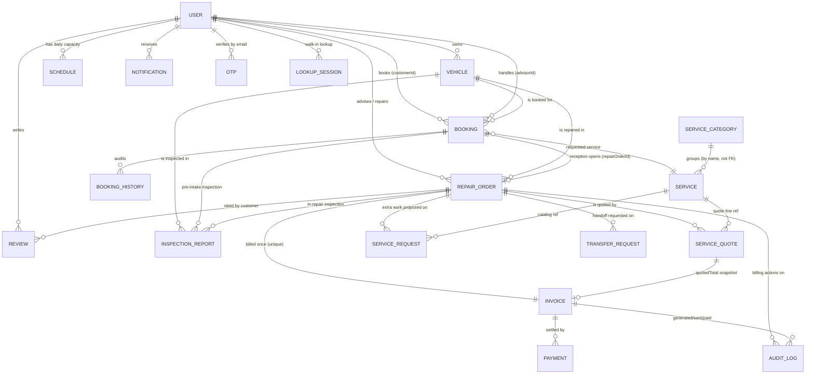
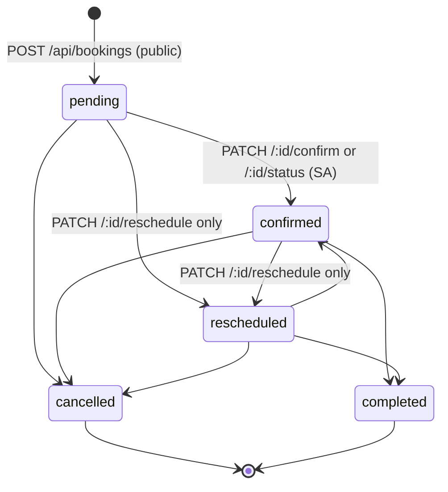
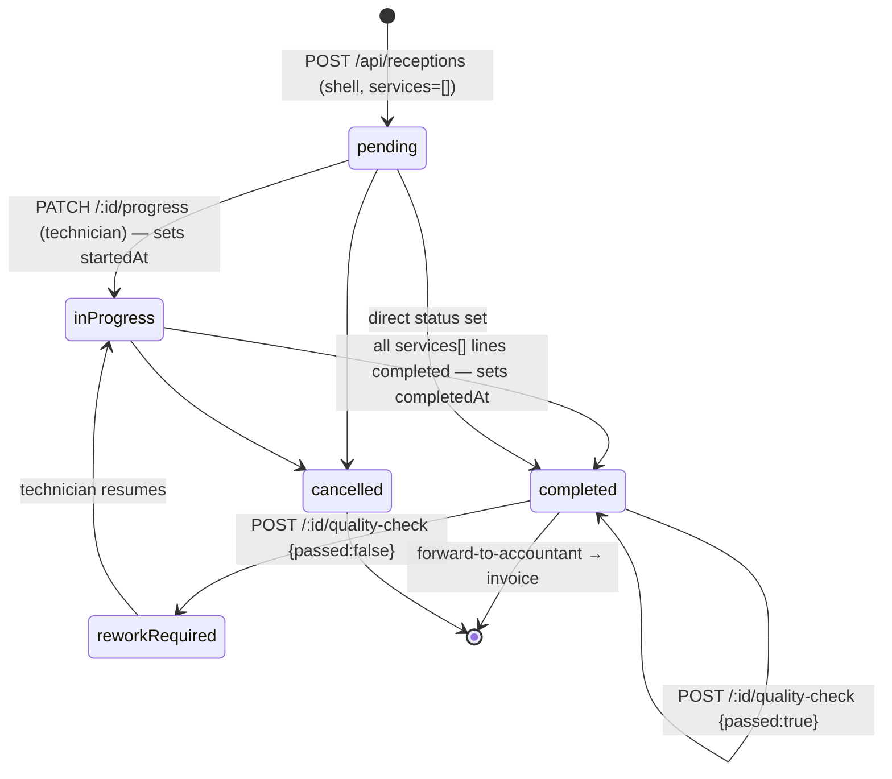
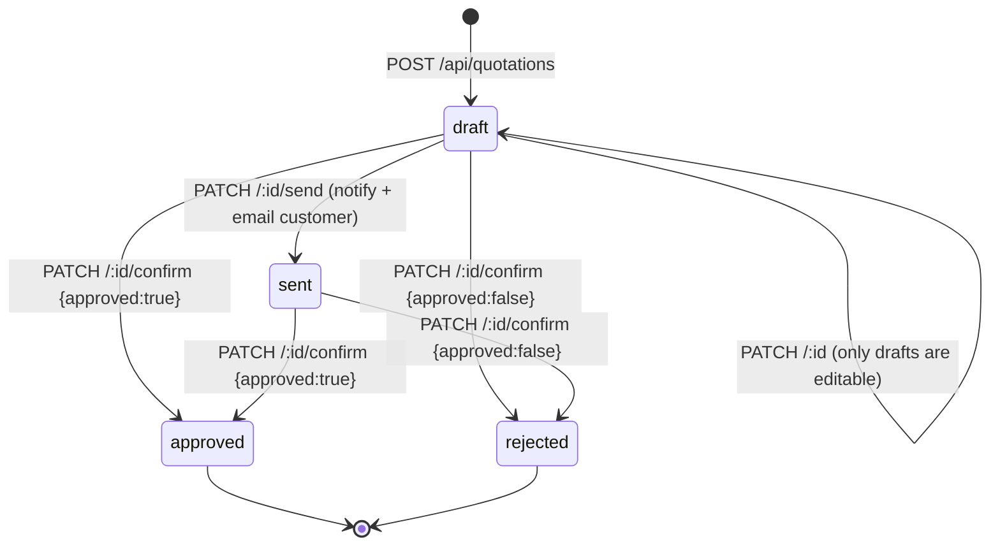
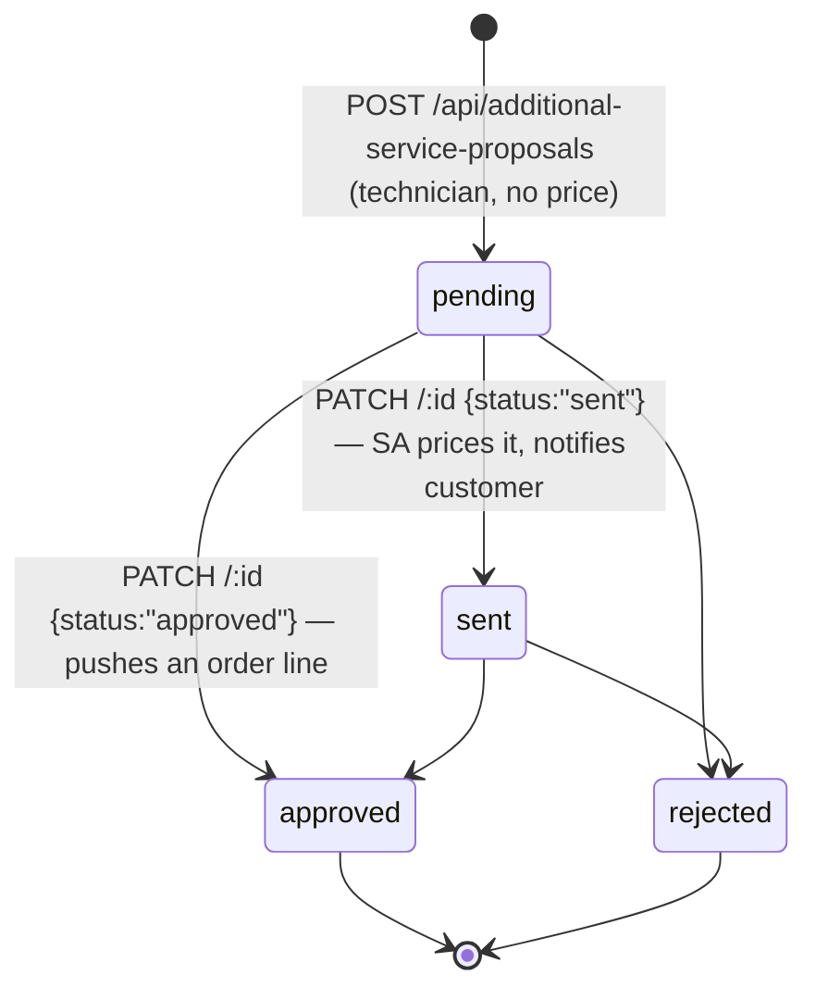
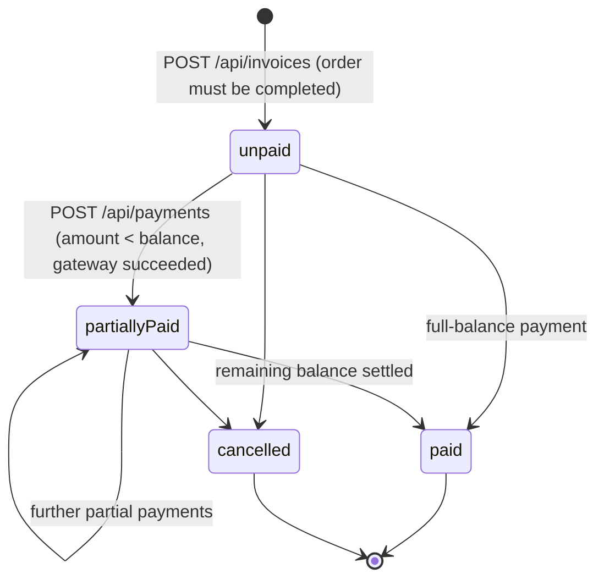
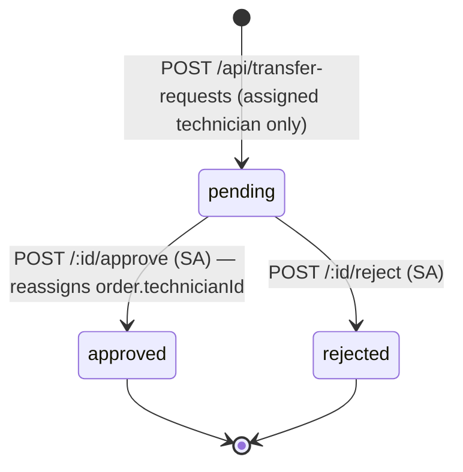
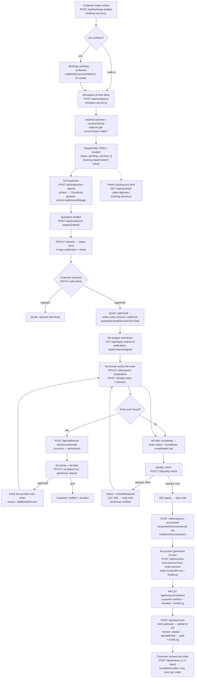

<!-- refreshed: 2026-07-23 -->
# Architecture

**Analysis Date:** 2026-07-23

## System Overview

```text
┌─────────────────────────────────────────────────────────────────────────────┐
│                    Browser SPA — React 19 + Vite + TS                        │
│                             `frontend/src`                                   │
├──────────────────┬──────────────────┬──────────────────┬────────────────────┤
│  pages/*         │  widgets/*       │  shared/auth     │  shared/lib        │
│  route screens   │  role shells,    │  JWT ctx +       │  apiRequest()      │
│  + per-page api/ │  notif center    │  route guards    │  fetch wrapper     │
│ `frontend/src/`  │                  │                  │ `shared/lib/       │
│ `pages`          │ `widgets`        │ `shared/auth`    │  api-client.ts`    │
└────────┬─────────┴────────┬─────────┴────────┬─────────┴─────────┬──────────┘
         │  fetch(`${VITE_API_BASE_URL}/api/...`, Bearer <jwt>)    │
         ▼                  ▼                  ▼                   ▼
┌─────────────────────────────────────────────────────────────────────────────┐
│                       Express app — `backend/src/app.js`                      │
│  requestLogger → cors → express.json → /api/health → createApiRouter()        │
│                       → notFound → errorHandler                              │
└─────────────────────────────────────────────┬───────────────────────────────┘
                                              ▼
┌─────────────────────────────────────────────────────────────────────────────┐
│  routes/       requireAuth → requireRole(...) → catchAsync(controller)        │
│  `backend/src/routes/*.routes.js`  (mounted in `routes/index.js`)             │
└─────────────────────────────────────────────┬───────────────────────────────┘
                                              ▼
┌─────────────────────────────────────────────────────────────────────────────┐
│  controllers/  thin — unwrap req.body/req.params/req.user, pick status code   │
│  `backend/src/controllers/*.controller.js`                                    │
└─────────────────────────────────────────────┬───────────────────────────────┘
                                              ▼
┌─────────────────────────────────────────────────────────────────────────────┐
│  services/     ALL business rules, validation, state machines, notifications  │
│  `backend/src/services/*.service.js`                                          │
│  side-effects → utils/notify.js · utils/mailer.js · utils/audit.js            │
│                 utils/cloudinary.js · utils/paymentGateway.js                 │
└─────────────────────────────────────────────┬───────────────────────────────┘
                                              ▼
┌─────────────────────────────────────────────────────────────────────────────┐
│  repositories/ createRepository(Model) CRUD + `.model` escape hatch           │
│  `backend/src/repositories/*.repository.js` (`base.repository.js`)            │
└─────────────────────────────────────────────┬───────────────────────────────┘
                                              ▼
┌─────────────────────────────────────────────────────────────────────────────┐
│  models/       Mongoose schemas, enums, indexes, pre-save hooks               │
│  `backend/src/models/*.model.js` (barrel: `models/index.js`)                  │
│                              ▼                                               │
│                        MongoDB (Mongoose 8)                                   │
└─────────────────────────────────────────────────────────────────────────────┘
```

## Component Responsibilities

| Component | Responsibility | File |
|-----------|----------------|------|
| App factory | Wires middleware chain, `/api/health`, mounts `/api` router | `backend/src/app.js` |
| Bootstrap | `connectDb()` then `app.listen()`, exits on failure | `backend/src/server.js` |
| API router | Mounts every domain router under its path prefix | `backend/src/routes/index.js` |
| Auth guard | `requireAuth` (Bearer JWT → `req.user`), `requireRole(...roles)` | `backend/src/middlewares/auth.middleware.js` |
| Error funnel | `ApiError` → status, Mongoose ValidationError/CastError → 400, dup key → 409 | `backend/src/middlewares/error.middleware.js` |
| Async wrapper | `catchAsync(fn)` so controllers can throw and reach `errorHandler` | `backend/src/utils/catchAsync.js` |
| Repository factory | Generic CRUD over a Mongoose model + `.model` for populate/aggregate | `backend/src/repositories/base.repository.js` |
| Reception | Opens the RepairOrder "spine" record from a booking or walk-in | `backend/src/services/reception.service.js` |
| Quotation | Builds/sends/confirms quotes; approval writes lines onto the order | `backend/src/services/quotation.service.js` |
| Repair order | Progress, step notes, quality check, forward-to-accountant | `backend/src/services/repair-order.service.js` |
| Additional service | Technician proposal → SA pricing/approval → extra order line | `backend/src/services/additional-service.service.js` |
| Invoice | Derives line items from the order server-side, one invoice per order | `backend/src/services/invoice.service.js` |
| Payment | Mock-gateway charge, partial payments, invoice settlement | `backend/src/services/payment.service.js` |
| Notification fan-out | `createNotification`, `notifyRole` — best-effort, never throws | `backend/src/utils/notify.js` |
| Audit trail | Billing-only audit rows (`invoiceGenerated`/`invoiceSent`/`paymentRecorded`) | `backend/src/utils/audit.js`, `backend/src/models/audit-log.model.js` |
| Route guards (FE) | `RequireAuth` / `RequireRole` redirect via `getPostLoginPath(role)` | `frontend/src/app/route-guards.tsx`, `frontend/src/shared/auth/routes.ts` |
| API client (FE) | Single `apiRequest<T>()` fetch wrapper, `ApiClientError`, FormData-aware | `frontend/src/shared/lib/api-client.ts` |

## Pattern Overview

**Overall:** Layered / clean-ish architecture on the backend (routes → controllers → services → repositories → models), Feature-Sliced-Design-flavoured folders on the frontend (`app`/`pages`/`widgets`/`shared`; `entities/` and `features/` exist but are empty).

**Key Characteristics:**
- Controllers are deliberately thin (most are 7–130 lines). All rules — validation, status transitions, notifications, emails — live in `backend/src/services/`.
- No ORM abstraction leak: services never `import { XModel }`; they go through `xRepository.model` when they need a raw populate/aggregate chain.
- Every enum and state machine constant is exported from its model file (e.g. `REPAIR_ORDER_STATUSES` from `backend/src/models/repair-order.model.js`) and imported by services for validation — a single source of truth.
- Denormalized snapshots everywhere money is involved: `RepairOrder.services[].priceAtTime`, `ServiceQuote.customerName/vehiclePlate`, `RepairOrder.quotedDiscountPercent/quotedTaxPercent/quotedTotal`, `Invoice.quotedTotal`. Historical documents must stay readable after the source record changes.
- One "spine" record: the `RepairOrder`. Reception opens it; inspection, quotation, technician work, QC, invoice and review all attach to it via `repairOrderId` (carried through the SA UI as `?orderId=`).
- Notifications/emails are fire-and-forget: `createNotification` swallows its own errors; `sendEmail` is invoked with `void ... .catch(() => {})` so SMTP latency never blocks a request.

## Layers

**Routes (`backend/src/routes/`):**
- Purpose: URL → guard chain → controller. Nothing else.
- Contains: `Router()` instances, `requireAuth`, `requireRole`, `imageUpload().array(...)`, `validateBody(...)`, `catchAsync(...)`.
- Depends on: middlewares, controllers, `utils/catchAsync.js`.
- Used by: `backend/src/routes/index.js` → `backend/src/app.js`.

**Controllers (`backend/src/controllers/`):**
- Purpose: HTTP adapter — read `req.body`/`req.params`/`req.query`/`req.user`, call the service, choose status code.
- Depends on: `../services/*.service.js` only (`import * as xService`).
- Used by: routes.
- Rule: controllers must never touch repositories or models.

**Services (`backend/src/services/`):**
- Purpose: business logic, invariants, state machines, cross-entity orchestration, notifications/email/audit side-effects.
- Depends on: repositories, model-exported enums, `utils/*`.
- Used by: controllers, and occasionally other services (`reception.service.js` reuses `resolveCustomer`/`resolveVehicle` from `booking.service.js`).
- Errors: throw `new ApiError(status, message)` from `backend/src/utils/apiError.js`.

**Repositories (`backend/src/repositories/`):**
- Purpose: the only place a Mongoose model is imported.
- Contains: one-liners like `export const bookingRepository = createRepository(BookingModel);`.
- Escape hatch: `xRepository.model` exposes the raw model for `.populate()`/`.aggregate()` chains.

**Models (`backend/src/models/`):**
- Purpose: schema, enums, indexes, hooks.
- Contains: 21 schemas + barrel `index.js`.
- Business logic in models is limited to `Booking`'s `pre("save")` seat-lock hook and JSON transforms (`User` strips `passwordHash`).

## Domain Model

### Entity relationship diagram



### Entity reference

| Model | File | Key fields / invariants |
|-------|------|-------------------------|
| `User` | `backend/src/models/user.model.js` | `role` ∈ `USER_ROLES`; `accountType` ∈ `["registered","walkIn"]`; `email`/`lookupCode` unique+sparse; `toJSON` strips `passwordHash` |
| `Vehicle` | `backend/src/models/vehicle.model.js` | `licensePlate` unique + uppercased; `lastKnownMileage` refreshed by reception/inspection |
| `Booking` | `backend/src/models/booking.model.js` | seat-lock unique index `{bookingDate,timeSlot,seatNo}` partial on `occupiesSlot:true`; `pre("save")` syncs `occupiesSlot` from status |
| `BookingHistory` | `backend/src/models/booking-history.model.js` | append-only trail of created/confirmed/cancelled/rescheduled/completed |
| `InspectionReport` | `backend/src/models/inspection-report.model.js` | exactly one of `bookingId`/`repairOrderId` (enforced in the service, not the schema); `items[].status` ∈ `ok/monitor/repair` |
| `ServiceQuote` | `backend/src/models/service-quote.model.js` | `repairOrderId` required; `lines[].kind` ∈ `service/part/labor`; snapshots customer/vehicle strings |
| `RepairOrder` | `backend/src/models/repair-order.model.js` | the spine; `services[]` with `priceAtTime`/`kind`/`source`/per-line `status`; `stepNotes[]` with photos; quote snapshot fields; `forwardedToAccountantAt`, `invoicedAt` |
| `ServiceRequest` | `backend/src/models/service-request.model.js` | technician's additional-service proposal; `laborCost`/`partsCost` set by the SA, never the technician |
| `TransferRequest` | `backend/src/models/transfer-request.model.js` | technician→technician handoff, resolved by an SA |
| `Invoice` | `backend/src/models/invoice.model.js` | `repairOrderId` **unique** — one invoice per order; `amountPaid` drives `status` |
| `Payment` | `backend/src/models/payment.model.js` | one row per charge attempt (including failures); `reference` is the accountant-entered bank ref |
| `Review` | `backend/src/models/review.model.js` | unique `{customerId, repairOrderId}` — one review per order |
| `Service` / `ServiceCategory` | `backend/src/models/service.model.js`, `service-category.model.js` | `Service.category` stores the **category name string**, not a FK |
| `Part` | `backend/src/models/part.model.js` | `sku` unique + uppercased; admin-only catalog |
| `Schedule` | `backend/src/models/schedule.model.js` | unique `{technicianId, date}`; `activeOrderIds`/`activeOrderCount` |
| `Notification` | `backend/src/models/notification.model.js` | `refPath: "refModel"` → `Booking` or `RepairOrder` only |
| `AuditLog` | `backend/src/models/audit-log.model.js` | billing-only actions; see `AUDIT_ACTIONS` |
| `Otp` | `backend/src/models/otp.model.js` | SHA-256 `codeHash` only, TTL index on `expiresAt`, attempt counter |
| `LookupSession` | `backend/src/models/lookup-session.model.js` | TTL index on `expiredAt` for walk-in code lookups |
| `RevenueReport` | `backend/src/models/revenue-report.model.js` | persisted aggregate (`byService`/`byTechnician`/`byPaymentMethod`) |

## RBAC Model

**Roles** — `USER_ROLES` in `backend/src/models/user.model.js`:
`onlineCustomer`, `walkInCustomer`, `serviceAdvisor`, `technician`, `accountant`, `admin`.

**Who can log in** — `LOGIN_ROLES` in `backend/src/services/auth.service.js`: everyone except `walkInCustomer`. Walk-ins have no password; they are created implicitly by `resolveCustomer()` in `backend/src/services/booking.service.js` and reach their data through the public tracking endpoint / lookup codes.

**Who creates whom:**
- `POST /api/auth/register` always creates `onlineCustomer` + `accountType: "registered"` (`auth.service.js:51`).
- `POST /api/auth/staff` (admin only) creates `STAFF_ROLES = serviceAdvisor | technician | accountant | admin` (`auth.service.js:102`).
- Reception/booking create `walkInCustomer` + `accountType: "walkIn"` on the fly.

**Enforcement mechanics** (`backend/src/middlewares/auth.middleware.js`):
1. `requireAuth` reads `Authorization: Bearer <token>`, verifies with `verifyAccessToken` (`backend/src/utils/jwt.js`), sets `req.user = { sub, role }`. 401 otherwise.
2. `requireRole(...roles)` runs after it; 403 if `req.user.role` is not in the list.
3. There is **no** resource-ownership middleware. Ownership checks live inside services — e.g. `createReview` compares `order.vehicleId.customerId` to `customerId`, `createTransferRequest` compares `repairOrder.technicianId` to the caller, `addStepNote` forces the author to `requester.sub` unless the caller is an admin.

**Role → API surface** (from the `requireRole` calls in `backend/src/routes/`):

| Area | Public | onlineCustomer | serviceAdvisor | technician | accountant | admin |
|------|--------|----------------|----------------|------------|------------|-------|
| `GET /api/bookings/slots`, `POST /api/bookings` | ✅ | ✅ | ✅ | ✅ | ✅ | ✅ |
| `GET /api/bookings`, `/:id`, `PATCH /:id/confirm`, `/:id/status` | — | — | ✅ | — | — | ✅ |
| `PATCH /api/bookings/:id/cancel`, `/reschedule` | — | owner | ✅ | — | — | ✅ |
| `GET /api/tracking` | ✅ | ✅ | ✅ | ✅ | ✅ | ✅ |
| `GET /api/services`, `/services/categories` | ✅ | ✅ | ✅ | ✅ | ✅ | ✅ |
| `POST/PUT/DELETE /api/services*`, `/admin/parts/*` | — | — | — | — | — | ✅ |
| `POST /api/receptions`, `GET /api/receptions/history` | — | — | ✅ | — | — | ✅ |
| `GET/POST /api/inspection-reports` | — | — | ✅ | ✅ | — | ✅ |
| `GET/POST/PATCH /api/quotations` (`GET /:id` also accountant) | — | — | ✅ | — | read-one | ✅ |
| `GET /api/repair-orders`, `/:id`, `/:id/status`, `/:id/summary`, `/:id/step-notes` | — | — | ✅ | ✅ | ✅ | ✅ |
| `GET /api/repair-orders/mine`, `/api/invoices/mine`, `POST /api/reviews` | — | ✅ | — | — | — | — |
| `POST /api/repair-orders`, `PUT /:id` (assignment) | — | — | ✅ | — | — | ✅ |
| `PATCH /api/repair-orders/:id/progress` | — | — | ✅ | ✅ | — | ✅ |
| `POST /api/repair-orders/:id/step-notes` | — | — | — | ✅ | — | ✅ |
| `POST /api/repair-orders/:id/quality-check`, `/forward-to-accountant` | — | — | ✅ | — | — | ✅ |
| `DELETE /api/repair-orders/:id`, `/step-notes/:noteIndex` | — | — | — | — | — | ✅ |
| `POST /api/additional-service-proposals` | — | — | — | ✅ | — | ✅ |
| `PATCH /api/additional-service-proposals/:id` (price + decide) | — | — | ✅ | — | — | ✅ |
| `POST /api/transfer-requests` | — | — | — | ✅ | — | — |
| `GET /api/transfer-requests`, `/:id/approve`, `/:id/reject` | — | — | ✅ | — | — | ✅ |
| `GET/POST/PATCH /api/schedules*` | — | — | ✅ | ✅ | — | ✅ |
| `GET/POST/PATCH /api/invoices*` (except `/mine`) | — | — | — | — | ✅ | ✅ |
| `POST/GET /api/payments*` | — | — | — | — | ✅ | ✅ |
| `GET /api/audit-logs` | — | — | — | — | ✅ | ✅ |
| `GET /api/admin/stats/*`, `/admin/reports/*` | — | — | — | — | ✅ | ✅ |
| `GET /api/admin/users` (technicians get technicians only) | — | — | ✅ | ✅ | — | ✅ |
| `PATCH /api/admin/users/:id/deactivate` | — | — | — | — | — | ✅ |
| `GET/PATCH/DELETE /api/notifications*` | — | ✅ | ✅ | ✅ | ✅ | ✅ |
| `GET /api/advisor/dashboard` | — | — | ✅ | — | — | ✅ |

**Frontend mirror:** `frontend/src/app/route-guards.tsx` + the per-route `<RequireRole roles={[...]}>` in `frontend/src/app/App.tsx`. Note the FE guards are single-role (`['serviceAdvisor']`, `['admin']`, …), so an admin is *redirected away* from advisor screens even though the API would allow the call. Post-login landing pages come from `ROLE_HOME_BY_ROLE` in `frontend/src/shared/auth/routes.ts`.

## State Machines

### Booking — `BOOKING_STATUSES` (`backend/src/models/booking.model.js`)

Transitions for `PATCH /api/bookings/:id/status` are declared in `STATUS_TRANSITIONS` (`backend/src/services/booking.service.js:35`).



Invariants:
- `rescheduled` is **not** reachable via `/:id/status` — it must go through `/:id/reschedule` so a fresh seat is claimed.
- `occupiesSlot` is derived from status by the `pre("save")` hook; `ACTIVE_BOOKING_STATUSES = ["pending","confirmed","rescheduled"]` (`backend/src/config/constants.js`). Status changes **must** use `.save()`; `updateOne`/`findOneAndUpdate`/`bulkWrite` bypass the hook and leak a locked seat.
- Slot capacity is `SLOT_CAPACITY = 5` per hourly slot 08:00–16:00, enforced atomically by the partial unique index on `{bookingDate, timeSlot, seatNo}`.

### RepairOrder — `REPAIR_ORDER_STATUSES` (`backend/src/models/repair-order.model.js`)



Invariants (`backend/src/services/repair-order.service.js`):
- `completed` and `cancelled` are frozen: `updateRepairProgress` refuses any other target status once there.
- When a `stepIndex` is supplied, the order status is **derived** from `services[].status`: all `completed` → `completed`; any `inProgress`/`completed` → `inProgress`; else `pending`. A technician finishing one line can never mark the whole job done.
- `quality-check` requires `status === "completed"`; failing sets `reworkRequired` and appends a `[QC fail] …` step note; passing appends `[QC pass] …`.
- `forward-to-accountant` requires `status === "completed"` and refuses if `forwardedToAccountantAt` is already set; it fans a notification out to every accountant via `notifyRole("accountant", …)`.

### ServiceQuote — `QUOTE_STATUSES` (`backend/src/models/service-quote.model.js`)



Invariants (`backend/src/services/quotation.service.js`):
- Only a `draft` can be edited or sent; only `draft`/`sent` can be confirmed. `approved`/`rejected` are terminal.
- **Approval is the only place quote lines become order lines**: it writes `order.services`, `order.totalCost`, and snapshots `quoteId`, `quotedDiscountPercent`, `quotedTaxPercent`, `quotedTotal` onto the RepairOrder.
- `totalEstimate = round(subtotal × (1 − discount%) × (1 + tax%))`.

### ServiceRequest (additional-service proposal) — `SERVICE_REQUEST_STATUSES`



Invariants (`backend/src/services/additional-service.service.js`):
- Only `pending|sent|approved|rejected` are reachable today; the extra enum values (`approvedBySA`, `rejectedBySA`, `approvedByCustomer`, `rejectedByCustomer`) are reserved for a two-stage flow with no UI yet.
- `approved`/`rejected` are terminal — `TERMINAL_STATUSES` blocks re-decisions so no duplicate order line can be pushed.
- The technician's payload **never** carries a price. `laborCost`/`partsCost` are SA-supplied overrides on the PATCH; the approved order line is `priceAtTime = laborCost + partsCost`, `source: "additionalService"`.

### Invoice — `INVOICE_STATUSES` (`backend/src/models/invoice.model.js`)



Invariants (`backend/src/services/invoice.service.js`, `payment.service.js`):
- Requires `order.status === "completed"`; `repairOrderId` is unique so a second invoice 409s.
- Line items, subtotal and total are derived **server-side** from `order.services` — the client cannot dictate amounts. Default discount = the quoted `quotedDiscountPercent`; tax = `quotedTaxPercent`.
- `dueAt = issuedAt + 15 days` (`INVOICE_TERM_DAYS`).
- Payments may under-pay but never over-pay (`chargeAmount <= balanceDue`). Only a `succeeded` gateway result mutates `amountPaid`/`status`. A failed attempt still persists a `Payment` row.
- Generating/sending an invoice and recording a payment each write an `AuditLog` row.

### TransferRequest — `TRANSFER_REQUEST_STATUSES`



Invariants (`backend/src/services/transfer-request.service.js`): only the currently-assigned technician may open one; the order must not be `completed`/`cancelled`; a duplicate pending request to the same target 409s; approval re-checks that `order.technicianId` still equals `fromTechnicianId` before reassigning.

### InspectionReport — `INSPECTION_STATUSES`

`pending → completed`. Created against **either** a `bookingId` (SA pre-quote inspection) or a `repairOrderId` (during an open repair) — the service enforces the either/or. Creating one back-links `repairOrder.inspectionId` if unset, and bumps `vehicle.lastKnownMileage` when the odometer reading is fresher.

## End-to-End Business Flow



**Parallel/side flows:**
- **Technician handoff:** `POST /api/transfer-requests` → SA approves → `order.technicianId` reassigned (`backend/src/services/transfer-request.service.js`).
- **Public tracking:** `GET /api/tracking?plate=…&phone=…` or `&orderId=…` — unauthenticated, matches plate against the vehicle owner's phone (`backend/src/services/tracking.service.js:147`). Backs `/tracking` in the SPA.
- **Reporting:** `GET /api/admin/reports/revenue` aggregates paid invoices into a `RevenueReport` (`backend/src/services/admin.service.js:244`).

## Data Flow

### Primary request path

1. Browser calls `apiRequest('/api/quotations/:id/confirm', { method: 'PATCH', token })` (`frontend/src/shared/lib/api-client.ts:37`).
2. `requestLogger` → `cors` → `express.json()` (`backend/src/app.js:13`).
3. `createApiRouter()` dispatches `/quotations` → `quotationRouter` (`backend/src/routes/index.js:45`).
4. `requireAuth` verifies the JWT and sets `req.user` (`backend/src/middlewares/auth.middleware.js:7`).
5. `requireRole("serviceAdvisor","admin")` gates it (`backend/src/routes/quotation.routes.js:54`).
6. `catchAsync(confirmQuotation)` → controller unwraps `req.params.id`, `req.body.approved` (`backend/src/controllers/quotation.controller.js`).
7. Service enforces the state machine, mutates `ServiceQuote` **and** `RepairOrder`, fires notifications (`backend/src/services/quotation.service.js:164`).
8. Repository/`.model` persists via Mongoose; thrown `ApiError`s land in `errorHandler` (`backend/src/middlewares/error.middleware.js:14`) as `{ error: message }`.

### Frontend data flow

1. `AuthProvider` hydrates the token from storage (`frontend/src/shared/auth/AuthProvider.tsx`, `storage.ts`) — routes render `RouteFallback` while `isHydrating`.
2. `RequireAuth`/`RequireRole` gate the route (`frontend/src/app/route-guards.tsx`).
3. Page components call their co-located API module (`frontend/src/pages/<role>/**/api/*.ts` or `frontend/src/pages/<role>/api/<role>Api.ts`), which calls `apiRequest` with the token.
4. State is local React state per page — **no** Redux/Zustand/React Query in the tree.

**State Management:** React `useState`/`useEffect` per page + one global `AuthContext`. Server data is refetched on mount/action rather than cached.

## Key Abstractions

**Repository factory:**
- Purpose: one generic CRUD wrapper instead of 20 hand-written ones.
- Example: `backend/src/repositories/base.repository.js`, used by every `*.repository.js` (most are 4–7 lines).
- Pattern: `createRepository(Model)` returning `{ model, findById, findOne, find, create, updateById, deleteById, countDocuments, exists, aggregate }`.

**`ApiError` + `catchAsync`:**
- Purpose: services throw domain errors; one middleware maps them to HTTP.
- Example: `backend/src/utils/apiError.js`, `backend/src/utils/catchAsync.js`, `backend/src/middlewares/error.middleware.js`.

**Line-item snapshot chain:**
- Purpose: money must never be recomputed from mutable catalog data.
- Chain: `ServiceQuote.lines[]` → (on approve) `RepairOrder.services[]` with `priceAtTime`/`kind`/`source` → (on invoice) `Invoice.lineItems[]` with the same `kind`/`source`.
- Files: `backend/src/services/quotation.service.js:186`, `backend/src/services/invoice.service.js:254`.

**Best-effort side-effect utilities:**
- `createNotification`/`notifyRole` swallow errors (`backend/src/utils/notify.js`); `logAudit` (`backend/src/utils/audit.js`); `sendEmail` (`backend/src/utils/mailer.js`) is always called as `void sendEmail(...).catch(() => {})`.

**Kapa template cloning (frontend):**
- Purpose: public marketing pages are a cloned WordPress theme rendered inside React.
- Files: `frontend/src/shared/lib/kapa-template/*` (`useClonedKapaPage.ts`, `parseTemplatePage.ts`, `pruneKapaNavbar.ts`, `rewriteKapaRouteLinks.ts`), static assets in `frontend/public/kapa-auth/`.

## Entry Points

**Backend HTTP server:**
- Location: `backend/src/server.js` → `backend/src/app.js`
- Triggers: `npm run dev` (nodemon) / `npm start`
- Responsibilities: connect Mongo first, then listen on `env.port`; exit(1) on failure.

**Backend scripts:**
- `backend/scripts/seed.js`, `seed-admin.js`, `backfill-booking-seats.js`, `backfill-invoiced-at.js`, `test-slot-concurrency.js`.

**Frontend SPA:**
- Location: `frontend/src/main.tsx` → `frontend/src/app/App.tsx`
- Triggers: `npm run dev` (Vite) / `npm run build`
- Responsibilities: mount router, lazy-load every role screen behind `Suspense`.

## Architectural Constraints

- **Threading:** single Node event loop. No worker threads, no queues, no cron. Email and Cloudinary uploads happen inline within the request (email is fire-and-forget; Cloudinary uploads are awaited).
- **Transactions:** none. Multi-document writes (e.g. approve quote → write order; record payment → update invoice) are sequential `.save()` calls and are **not** atomic. Concurrency safety is achieved only where a unique index does it — the booking seat lock (`{bookingDate,timeSlot,seatNo}` partial unique) and `Invoice.repairOrderId` unique.
- **Global state:** module-level singletons only — `env` (`backend/src/config/env.js`), the Mongoose connection (`backend/src/config/db.js`), and the exported `*Repository` objects. No mutable request-scoped globals.
- **Circular imports:** `reception.service.js` imports `resolveCustomer`/`resolveVehicle` from `booking.service.js` (one-directional; `booking.service.js` does not import back). No cycles detected.
- **ID validation:** every service re-validates ObjectIds with a local `const OID_RE = /^[0-9a-fA-F]{24}$/` (or `mongoose.isValidObjectId` in the invoice/payment services). This is duplicated in ~12 files.
- **No schema-validation library:** `validateBody` (`backend/src/middlewares/validate.middleware.js`) takes a plain `(body) => string | null` function. Only `backend/src/validators/auth.validator.js` exists; every other endpoint validates inside its service.
- **Enum drift risk:** the same status strings are declared in the model, re-listed in services (`FE_STATUSES` in `additional-service.service.js`), and again as TS unions in the frontend API modules. Changing one requires changing all three.
- **File uploads:** memory-only multer (`backend/src/middlewares/upload.middleware.js`, 5 MB image cap) → Cloudinary. There is no local upload directory to persist.

## Anti-Patterns

### Mutating booking status without `.save()`

**What happens:** using `updateOne`/`findOneAndUpdate`/`bulkWrite` to change `Booking.status`.
**Why it's wrong:** the `pre("save")` hook in `backend/src/models/booking.model.js:98` is the only thing that syncs `occupiesSlot`. Bypassing it leaves a cancelled booking still holding a seat in the partial unique index, permanently reducing that slot's capacity.
**Do this instead:** load the document, assign `booking.status`, `await booking.save()` — as `updateBookingStatus` does in `backend/src/services/booking.service.js:604`.

### Importing a Mongoose model inside a service or controller

**What happens:** `import { RepairOrderModel } from "../models/index.js"` in a service.
**Why it's wrong:** breaks the single-owner rule for model references and makes the repository layer pointless.
**Do this instead:** `import { repairOrderRepository } from "../repositories/repair-order.repository.js"` and use `repairOrderRepository.model` for populate/aggregate chains (`backend/src/repositories/base.repository.js:6` documents this escape hatch). The one sanctioned exception is `backend/src/utils/notify.js`, which imports `NotificationModel`/`UserModel` directly.

### Putting business rules in a controller

**What happens:** validating input or checking a status transition inside `*.controller.js`.
**Why it's wrong:** controllers are untestable without Express; the unit test suite (`backend/tests/unit/*.service.test.js`) targets services.
**Do this instead:** keep controllers to `const result = await xService.doThing(req.body, req.user.sub); res.json(result)` — see `backend/src/controllers/reception.controller.js` (18 lines).

### Trusting client-supplied money

**What happens:** accepting `total`, `subtotal`, or a technician-supplied `laborCost`/`partsCost` from the request body.
**Why it's wrong:** pricing authority is role-bound. `createAdditionalServiceProposal` explicitly refuses cost fields from technicians (`backend/src/services/additional-service.service.js:42`); `generateInvoiceFromRepairOrder` derives every figure from `order.services` (`backend/src/services/invoice.service.js:254`).
**Do this instead:** derive amounts server-side from the persisted order/quote and only accept a bounded override (e.g. `discount` clamped to `0..subtotal`).

### Blocking a request on SMTP

**What happens:** `await sendEmail({...})` in a service.
**Why it's wrong:** a slow or unreachable SMTP host hangs the SA's "Send quote" click. The in-app notification is the primary signal.
**Do this instead:** `void sendEmail({...}).catch(() => {})` and return a `hasEmailOnFile` flag so the UI can say whether an email was even attempted — see `backend/src/services/quotation.service.js:142`.

### Awaiting a notification as if it were critical

**What happens:** assuming `createNotification` throwing will roll something back.
**Why it's wrong:** it deliberately swallows and logs (`backend/src/utils/notify.js:29`); a notification failure must never break the business action.
**Do this instead:** treat notifications as advisory; persist the business state first, notify after.

## Error Handling

**Strategy:** services throw `ApiError(status, message)`; routes wrap handlers in `catchAsync`; one `errorHandler` serializes everything.

**Patterns:**
- `throw new ApiError(400, "...")` for bad input, `404` for missing, `403` for ownership, `409` for state conflicts (already-received booking, duplicate invoice, terminal status), `422` for unresolvable references.
- Mongoose `ValidationError`/`CastError` → 400; duplicate key (`code === 11000`) → 409 "Resource already exists".
- `status >= 500` logs the stack via `backend/src/utils/logger.js`; the client only ever sees `{ error: string }`.
- Frontend: `apiRequest` reads `payload.error || payload.message` and throws `ApiClientError` with `.status`; network failure surfaces as status `0`.

## Cross-Cutting Concerns

**Logging:** `requestLogger` writes one line per request (`method url status ms`) via `backend/src/utils/logger.js`. No structured/JSON logging, no request correlation IDs.

**Validation:** two-tier — `validateBody(validator)` middleware for auth routes only (`backend/src/validators/auth.validator.js`), inline guard clauses at the top of every service function for everything else.

**Authentication:** stateless JWT (`{ sub, role }`) signed by `backend/src/utils/jwt.js`; no refresh tokens, no server-side session store (aside from `LookupSession` for walk-in code lookups). Passwords hashed with bcryptjs (`backend/src/utils/password.js`). OTP flows store SHA-256 hashes with TTL indexes (`backend/src/models/otp.model.js`).

**Authorization:** `requireRole` for coarse role gating + in-service ownership checks for fine-grained rules.

**Notifications:** `Notification` documents (`refModel` limited to `Booking`/`RepairOrder`) surfaced by `frontend/src/widgets/notification-center`, polled through `frontend/src/shared/api/notifications.ts`.

**Auditing:** two separate trails — `BookingHistory` for appointment lifecycle changes, `AuditLog` for billing actions only (`AUDIT_ACTIONS = ["invoiceGenerated","invoiceSent","paymentRecorded"]`).

**File storage:** Cloudinary via `backend/src/utils/cloudinary.js`; only secure URLs are persisted (`InspectionReport.photos`, `RepairOrder.stepNotes[].photos`, `ServiceCategory.imageUrl`).

**Payments:** mock gateway at `backend/src/utils/paymentGateway.js` (`charge({ amount, method, simulate })`) — no real PSP integration.

---

*Architecture analysis: 2026-07-23*
