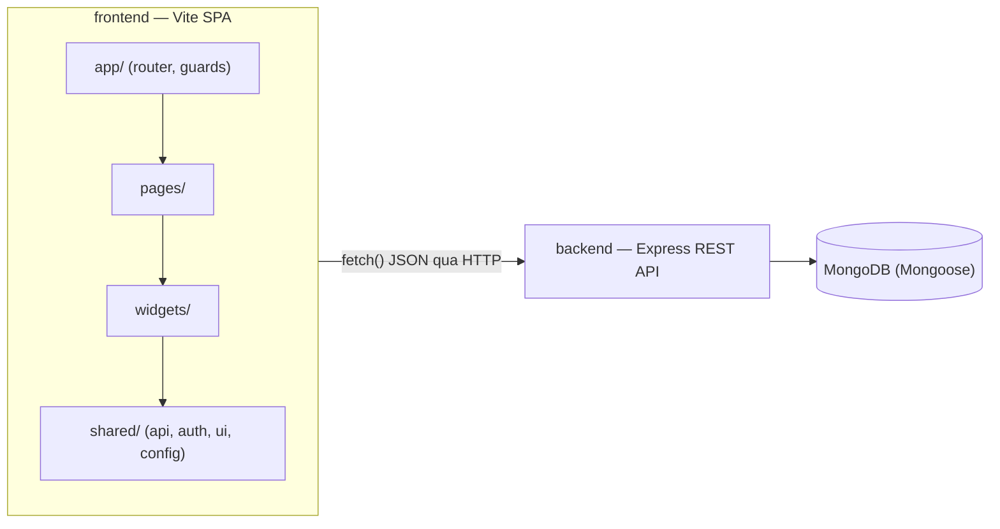

# Garage Management System — Tài liệu Kỹ thuật Frontend

> Toàn bộ nội dung dưới đây được trích trực tiếp từ source code trong repo (thư mục `frontend/`) tại thời điểm viết tài liệu. Mỗi khẳng định kèm đường dẫn file + đoạn code làm bằng chứng. Các đoạn "Lý thuyết" xen giữa giải thích *tại sao* cơ chế đó tồn tại (CSS cascade, specificity, Tailwind JIT, Antd design-token/CSS-in-JS...), không chỉ mô tả code làm gì.

---

## 1. Design System

### 1.1 Công nghệ định nghĩa Design Token

Dự án dùng **CSS Custom Properties (`:root` variables)** làm nguồn chân lý (source of truth) cho token, cộng thêm một **TypeScript object** đồng bộ thủ công cho những chỗ cần đọc giá trị token trong logic JS (ví dụ `RouteFallback` ở [App.tsx](frontend/src/app/App.tsx#L67-L69) tô màu nền bằng `theme.color.surfaceStrong`). Dự án **không** dùng Tailwind `theme.config` kiểu v3 (không tồn tại file `tailwind.config.*` — xem mục 5.1) và **không** dùng Antd `ConfigProvider` token cho màu sắc/spacing ở cấp global (chỉ set `fontFamily` ở gốc — xem mục 4.3).

**Lý thuyết — vì sao CSS Custom Properties khác biến Sass/Less:** `--color-primary` là một *biến runtime*, tồn tại trong cây DOM thật (kế thừa qua `inherit` giống mọi thuộc tính CSS khác), có thể bị ghi đè theo từng scope (`.dark { --color-text: #fff }`) mà không cần build lại CSS, và đọc được bằng `getComputedStyle()` trong JS. Biến Sass/Less (`$color-primary`) chỉ là text-substitution ở compile-time — không tồn tại lúc runtime, không thể theme-switch động. Dự án chọn CSS variables vì cần các back-office role (admin/advisor/technician/accountant) đổi màu accent theo palette riêng mà không phải build 4 bundle CSS khác nhau (xem mục 1.2).

```css
// frontend/src/shared/config/theme.css
:root {
  --font-body: "Spartan", sans-serif;
  --font-display: "Oswald", sans-serif;
  --color-primary: #f51304;
  --color-primary-hover: #d60e02;
  --color-background: #ffffff;
  --color-surface: #ffffff;
  --color-surface-strong: #0f0e0e;
  --color-surface-muted: #f8f8f8;
  --color-text: #0f0e0e;
  --color-text-muted: #646464;
  --color-border: rgba(15, 14, 14, 0.12);
  --color-on-primary: #ffffff;
  --shadow-soft: 0 18px 50px rgba(15, 14, 14, 0.08);
  --radius-card: 24px;
}
```

**Đồng bộ TypeScript object** (dùng khi cần giá trị token trong logic React, không phải trong className/style CSS):

```ts
// frontend/src/shared/config/theme.ts
export const theme = {
  fontFamily: { body: '"Spartan", sans-serif', display: '"Oswald", sans-serif' },
  color: {
    primary: '#f51304',
    background: '#ffffff',
    surfaceStrong: '#0f0e0e',
    text: '#0f0e0e',
    textMuted: '#646464',
    onPrimary: '#ffffff',
    // ...
  },
  shadow: { soft: '0 18px 50px rgba(15, 14, 14, 0.08)' },
  radius: { card: 24 },
} as const
```

Hai định nghĩa này **không tự động đồng bộ** — nếu sửa `--color-primary` trong `theme.css` mà quên sửa `theme.color.primary` trong `theme.ts`, hai nguồn sẽ lệch nhau (không có build step nào generate file này từ file kia).

### 1.2 Bảng màu

| Tên biến CSS | Giá trị | Ngữ nghĩa |
|---|---|---|
| `--color-primary` | `#f51304` | Màu chính (đỏ thương hiệu Kapa) — brand accent, nút chính, link |
| `--color-primary-hover` | `#d60e02` | Hover state của primary |
| `--color-background` | `#ffffff` | Nền trang |
| `--color-surface` | `#ffffff` | Nền card/panel |
| `--color-surface-strong` | `#0f0e0e` | Nền đậm (loading screen, sidebar dark) |
| `--color-surface-muted` | `#f8f8f8` | Nền phụ nhạt |
| `--color-text` | `#0f0e0e` | Chữ chính (gần đen) |
| `--color-text-muted` | `#646464` | Chữ phụ/mô tả |
| `--color-border` | `rgba(15,14,14,0.12)` | Viền dùng chung |
| `--color-on-primary` | `#ffffff` | Chữ đặt trên nền primary (đảm bảo tương phản) |

**Back-office palette theo role** — mỗi role (`admin`, `accountant`, `advisor`, `technician`) có một object `BackOfficePalette` riêng, không dùng chung 10 biến CSS ở trên:

```ts
// frontend/src/widgets/backoffice-shell/model/palettes.ts
export type BackOfficePalette = {
  ink: string        // Chữ chính
  inkSoft: string     // Chữ phụ
  textMuted: string   // Chữ mờ
  canvas: string      // Nền trang
  panel: string       // Nền card
  panelAlt: string    // Nền card phụ
  border: string      // Viền
  red: string         // Accent chính / danger
  redDeep: string     // Accent đậm (hover)
  amber: string       // Warning
  teal: string
  navy: string
  green: string       // Success
  shadow: string
  violet?: string
}

export const adminPalette: BackOfficePalette = {
  ink: '#0f172a', inkSoft: '#334155', textMuted: '#64748b',
  canvas: '#f5f6f8', panel: '#ffffff', panelAlt: '#f1f3f6', border: '#e2e8f0',
  red: '#f51304', redDeep: '#c81003', amber: '#d97706', teal: '#0f766e',
  navy: '#1e3a5f', green: '#16a34a',
  shadow: '0 1px 2px rgba(15, 23, 42, 0.04), 0 10px 28px rgba(15, 23, 42, 0.07)',
}
```

`technicianPalette` dùng tông ấm hơn (`canvas: '#f7f2ec'`, `ink: '#0f0e0e'`) để phân biệt trực quan với 3 role còn lại vốn dùng chung tông "cool-neutral" (`#0f172a` / `#f5f6f8`) — comment trong code xác nhận chủ đích này: *"Cool-neutral palette (matches admin/advisor exactly) so the sidebar's dark navy gradient and the light content area read as one cohesive system"* ([palettes.ts:36-38](frontend/src/widgets/backoffice-shell/model/palettes.ts#L36-L38)).

Palette này không chỉ dùng cho CSS — nó còn **đổ thẳng vào Antd `ConfigProvider` token** (`colorPrimary: adminPalette.red`) để nút, link, focus-ring của Antd tự động đổi theo role. Chi tiết cơ chế này ở mục 4.3 — đây là điểm mà tài liệu bản trước ghi sai (nói Antd không sync màu).

### 1.3 Quy tắc spacing

Không có thang spacing 4px/8px chuẩn hoá qua Tailwind config (vì không có file config — Tailwind v4 lấy thang spacing mặc định từ `tailwindcss/theme.css`, xem mục 5.1). Có **hai hệ khác nhau song song**:

- **Back-office** (admin/advisor/technician/accountant): dùng Tailwind spacing scale mặc định qua utility class (`gap-3` = 12px, `p-6` = 24px, `mt-5` = 20px — thang này vẫn theo bội số 4px vì Tailwind v4 mặc định `spacing: 0.25rem` × n).
- **Customer-facing pages**: CSS thuần với giá trị pixel cố định thủ công, không theo thang 4px chặt chẽ (20px, 30px, 48px...).

```css
/* frontend/src/styles.css — spacing thủ công trong customer components */
.customer-panel {
  padding: 30px;
}
.customer-section {
  padding: 0 0 48px;
}
```

```tsx
// frontend/src/widgets/backoffice-shell/ui/BackOfficeShell.tsx — spacing qua Tailwind scale
<section className="min-w-0 px-4 py-5 md:px-6">
  <div className="bo-fade flex w-full min-w-0 flex-col gap-5 *:min-w-0">{children}</div>
</section>
```

**Lý do lệch nhau:** customer-facing pages kế thừa markup/CSS gốc từ một theme WordPress/Elementor tên "Kapa" (xem mục 5.1 và mục 8) — giá trị pixel đến từ theme gốc, không phải do dev tự chọn thang riêng.

### 1.4 Quy tắc shadow/elevation

Có **hai hệ shadow riêng biệt**, không dùng chung một thang elevation (không có `--shadow-1`, `--shadow-2`... theo cấp độ):

```css
/* frontend/src/shared/config/theme.css */
--shadow-soft: 0 18px 50px rgba(15, 14, 14, 0.08);
```
Dùng cho mọi "card" ở customer-facing pages: `.customer-panel`, `.customer-booking-card`, `.customer-stat-card`, `.customer-invoice-sheet`...

```ts
// frontend/src/widgets/backoffice-shell/model/palettes.ts — shadow theo palette, không phải theo cấp
shadow: '0 1px 2px rgba(15, 23, 42, 0.04), 0 10px 28px rgba(15, 23, 42, 0.07)'
```
Back-office dùng shadow **kép** (double box-shadow: một lớp sát viền + một lớp lan toả xa) — kỹ thuật phổ biến để mô phỏng elevation tự nhiên hơn so với 1 box-shadow đơn (Material Design gọi đây là "key light + ambient light"), áp dụng cho mọi `<Card>` Antd trong `StatCard` (mục 1.5).

### 1.5 Component implement đúng Design Token

**Lưu ý quan trọng:** file [`frontend/src/shared/ui/base.tsx`](frontend/src/shared/ui/base.tsx) có định nghĩa `StatCard`, `Card`, `Button`, `Badge` bằng Tailwind class, nhưng dùng bảng màu neon tối (`bg-[rgba(29,32,34,0.72)]`, `text-white`, accent `#00ffa3`) **không khớp** với token sáng/đỏ đã định nghĩa ở mục 1.1–1.2. Kiểm tra tham chiếu (`grep "from '.*shared/ui'"`) cho thấy **không file nào import từ đây** — đây là dead code còn sót lại trong repo, không nên dùng làm ví dụ "component chuẩn design token".

Component **thực sự** implement đúng token là `StatCard` ở `widgets/backoffice-shell`, được 7 trang back-office khác nhau dùng chung (admin reports, accountant invoices/payments, 4 trang advisor):

```tsx
// frontend/src/widgets/backoffice-shell/ui/StatCard.tsx
export function StatCard({ label, value, note, icon, palette, tone = 'red', enterDelay }: {
  label: string
  value: string | number
  palette: BackOfficePalette
  tone?: StatCardTone
  enterDelay?: number
}) {
  const displayValue = useCountUp(value)          // animation — xem mục 8.2
  const accent = toneAccent(palette, tone)

  return (
    <Card
      bordered={false}
      className={`bo-card-hover bo-enter${enterDelay ? ` bo-enter-${Math.min(enterDelay, 5)}` : ''} rounded-2xl`}
      style={{ background: palette.panel, boxShadow: palette.shadow, border: `1px solid ${palette.border}` }}
    >
      <div style={{ color: accent, fontSize: 28, fontWeight: 700 }}>{displayValue}</div>
      <div style={{ color: palette.textMuted, fontSize: 13 }}>{label}</div>
    </Card>
  )
}
```

Component này minh hoạ đúng chiến lược "Antd component + palette token" của dự án: dùng Antd `<Card>` làm khung (border/shadow control, DOM semantics), nhưng **màu sắc lấy từ `palette` prop** (không phải từ Antd theme token trực tiếp) — nghĩa là màu là dữ liệu truyền vào, không phải style cứng. Đây là lý do một component `StatCard` dùng được cho cả 4 role khác nhau chỉ bằng cách đổi `palette` prop.

---

## 2. Kiến trúc Package & Luồng giao tiếp Backend

### 2.1 Sơ đồ cấu trúc

Dự án **không phải monorepo pnpm + Turborepo** — không có `pnpm-workspace.yaml` hay `turbo.json` ở gốc repo. Đây là **hai app độc lập** (`frontend/` Vite app, `backend/` Express app) nằm chung một Git repo, kết nối qua HTTP REST, không qua workspace/package linking:

```
WDP301-project/
├── frontend/                 # Vite 8 + React 19 + Tailwind v4 + Antd v6
│   ├── src/
│   │   ├── app/               # Layer: App — router, providers, route-guards
│   │   ├── pages/              # Layer: Pages — 11 nhóm trang
│   │   ├── widgets/             # Layer: Widgets — 6 nhóm widget
│   │   ├── features/            # Layer: Features — trống (chỉ .gitkeep)
│   │   ├── entities/            # Layer: Entities — trống (chỉ .gitkeep)
│   │   ├── shared/               # Layer: Shared — api, auth, config, lib, ui
│   │   └── styles.css            # Global CSS (2000+ dòng)
│   ├── package.json
│   └── vite.config.ts
├── backend/                  # Express + Mongoose + MongoDB (Vitest cho test)
└── clone-2/                   # Bản clone phụ, không liên quan tới app chính
```



### 2.2 Feature-Sliced Design — 6 layer

| Layer | Thư mục ví dụ | Ghi chú |
|---|---|---|
| **app** | `src/app/App.tsx`, `src/app/route-guards.tsx` | Root routing, providers, `RequireAuth`/`RequireRole` |
| **pages** | `src/pages/admin/`, `src/pages/customer/`, `src/pages/advisor/` | 11 nhóm (admin, advisor, technician, accountant, customer, auth, appointment, home-five, our-brands, services, contact-us) |
| **widgets** | `src/widgets/backoffice-shell/`, `src/widgets/appointment-booking/` | 6 nhóm (appointment-booking, backoffice-shell, home-five-estimate, notification-center, service-advisor-shell, technician-shell) |
| **features** | `src/features/` (chỉ `.gitkeep`) | Chưa implement — mọi logic nghiệp vụ hiện nằm thẳng trong `pages/*/ui/*.tsx` |
| **entities** | `src/entities/` (chỉ `.gitkeep`) | Chưa implement — không có model/type dùng chung tách riêng theo domain entity |
| **shared** | `src/shared/api/`, `src/shared/auth/`, `src/shared/lib/`, `src/shared/ui/` | Code tái sử dụng: API layer, auth, theme, tiện ích |

**Lý thuyết — nguyên tắc import một chiều của FSD:** chuẩn FSD quy định layer thấp hơn (`shared`) không được import từ layer cao hơn (`widgets`, `pages`), tạo thành một dependency graph một chiều `shared ← entities ← features ← widgets ← pages ← app`, giúp mọi thay đổi ở layer cao không thể "rò" ngược xuống layer thấp và phá vỡ code dùng chung. Vì `features`/`entities` đang trống, dự án hiện chỉ thực sự có 4 layer hoạt động (`shared → widgets → pages → app`); nghiệp vụ (business logic) đáng lẽ nằm ở `features`/`entities` thì đang bị dồn thẳng vào `pages` — ví dụ toàn bộ validate + gọi API của form đặt lịch nằm ngay trong `widgets/appointment-booking/ui/AppointmentBookingForm.tsx` (xem mục 6.3) thay vì tách một `features/appointment-booking` riêng.

### 2.3 API Client — Tổ chức gọi API

Dùng **native `fetch()`** — không cài `axios`, không dùng React Query/SWR. Base URL đọc từ biến môi trường Vite:

```ts
// frontend/src/shared/lib/api-client.ts
export const API_BASE_URL = (import.meta.env.VITE_API_BASE_URL || 'http://localhost:4000').replace(/\/+$/, '')
```

**"Interceptor" xử lý token/lỗi** không phải là interceptor kiểu axios (`axios.interceptors.request.use`) mà là một hàm wrapper `apiRequest()` bọc quanh mọi lệnh gọi, tự gắn header và tự parse lỗi:

```ts
// frontend/src/shared/lib/api-client.ts
export async function apiRequest<T>(path: string, init: RequestInit & { token?: string | null } = {}) {
  try {
    const isFormData = init.body instanceof FormData
    const response = await fetch(`${API_BASE_URL}${path}`, {
      ...init,
      headers: {
        ...(isFormData ? {} : { 'Content-Type': 'application/json' }),
        ...(init.token ? { Authorization: `Bearer ${init.token}` } : {}),
        ...(init.headers || {}),
      },
    })
    if (!response.ok) await parseError(response)
    if (response.status === 204) return null as T
    return (await response.json()) as T
  } catch (error) {
    if (error instanceof ApiClientError) throw error
    throw new ApiClientError('Unable to connect to the server. Please check backend, CORS, or network status.', 0)
  }
}
```

Class lỗi riêng để phân biệt "lỗi có message từ backend" và "lỗi mạng/kết nối":

```ts
// frontend/src/shared/lib/api-client.ts
export class ApiClientError extends Error {
  status: number
  constructor(message: string, status = 500) {
    super(message)
    this.name = 'ApiClientError'
    this.status = status
  }
}
```

**Điểm đáng chú ý:** module `widgets/appointment-booking/api/appointmentApi.ts` **không tái sử dụng** `apiRequest`/`ApiClientError` ở trên — nó tự định nghĩa một bản sao gần như y hệt (`AppointmentApiError`, `requestJson()`), nhưng có thêm `AbortController` với timeout 12 giây mà bản chung không có:

```ts
// frontend/src/widgets/appointment-booking/api/appointmentApi.ts
const REQUEST_TIMEOUT_MS = 12000

async function requestJson<T>(path: string, init: RequestInit = {}) {
  const controller = new AbortController()
  const timeout = setTimeout(() => controller.abort(), REQUEST_TIMEOUT_MS)
  try {
    const response = await fetch(`${API_BASE_URL}${path}`, { ...init, signal: controller.signal, ... })
    if (!response.ok) await parseError(response)
    return (await response.json()) as T
  } catch (error) {
    if (error instanceof DOMException && error.name === 'AbortError') {
      throw new AppointmentApiError('The booking service took too long to respond...', 0)
    }
    throw new AppointmentApiError('Unable to connect to the booking service...', 0)
  } finally {
    clearTimeout(timeout)
  }
}
```

`shared/auth/api.ts` cũng tự định nghĩa `requestJson` riêng thứ ba. Tổng cộng dự án có **3 bản fetch-wrapper gần giống nhau** thay vì 1 module dùng chung — mỗi nơi tự implement lại logic parse lỗi/timeout.

### 2.4 Luồng gọi API cụ thể — Đặt lịch hẹn (Booking)

```
Component (widgets/appointment-booking)      API module                        Backend
────────────────────────────────             ──────────                        ───────
AppointmentBookingForm.tsx                →  appointmentApi.ts           →     POST /api/bookings
  handleSubmit(event)                         createAppointmentBooking()
    findMissingFieldMessage() — validate        requestJson('/api/bookings', ...)
    setSubmitState({type:'loading'})              fetch(API_BASE_URL + path, {signal, ...})
    await createAppointmentBooking(...)
    setSubmitState({type:'success'|'error'})
```

```tsx
// frontend/src/widgets/appointment-booking/ui/AppointmentBookingForm.tsx
const handleSubmit = async (event: FormEvent<HTMLFormElement>) => {
  event.preventDefault()
  const missingFieldMessage = findMissingFieldMessage(formState)
  if (missingFieldMessage) { setSubmitState({ type: 'error', message: missingFieldMessage }); return }
  setSubmitState({ type: 'loading', message: 'Sending your appointment request...' })
  try {
    const response = await createAppointmentBooking({ customer: {...}, vehicle: {...}, ... })
    setSubmitState({ type: 'success', message: formatSubmitMessage(response.booking._id, ...) })
  } catch (error) {
    setSubmitState({ type: 'error', message: error instanceof AppointmentApiError ? error.message : '...' })
  }
}
```

Endpoint backend tương ứng — route công khai (public), không yêu cầu đăng nhập, cho phép khách vãng lai đặt lịch:

```js
// backend/src/routes/booking.routes.js
// Public: customers browse availability and book without an account.
bookingRouter.get("/slots", catchAsync(getSlots));
bookingRouter.post("/", catchAsync(createBooking));
```

### 2.5 Xử lý loading/error state

Dùng **custom `useState` + `try/catch`/`finally` thủ công trong `useEffect`** — không dùng React Query/SWR nên không có cache, dedupe request, hay `stale-while-revalidate` tự động; mỗi page tự quản lý vòng đời fetch của nó, bao gồm cả việc tự huỷ khi unmount:

```ts
// Pattern lặp lại ở hầu hết mọi trang list-data (ví dụ CustomerBookingsPage, AdminUsersPage...)
const [loading, setLoading] = useState(true)
const [error, setError] = useState('')

useEffect(() => {
  let cancelled = false
  async function load() {
    setLoading(true)
    try {
      const response = await fetchSomething(token)
      if (!cancelled) setData(response)
    } catch (err) {
      if (!cancelled) setError(err instanceof Error ? err.message : '...')
    } finally {
      if (!cancelled) setLoading(false)
    }
  }
  void load()
  return () => { cancelled = true }   // huỷ setState nếu component unmount giữa chừng
}, [token])
```

Cờ `cancelled` là cách thủ công thay thế cho `AbortController`/React Query's built-in cancellation — tránh lỗi *"Can't perform a React state update on an unmounted component"* khi request về sau khi user đã điều hướng sang trang khác.

Back-office có thêm hook dùng chung để hiển thị message/toast kết quả API, tránh mỗi trang tự viết `useState<string>` + `useState<'success'|'error'>` lặp lại:

```ts
// frontend/src/widgets/backoffice-shell/lib/useApiMessage.ts
export function useApiMessage() {
  const [message, setMessage] = useState<string>()
  const [tone, setTone] = useState<ApiMessageTone>('error')
  const showError = useCallback((value: string) => { setTone('error'); setMessage(value) }, [])
  const showSuccess = useCallback((value: string) => { setTone('success'); setMessage(value) }, [])
  const clear = useCallback(() => setMessage(undefined), [])
  return { message, tone, showError, showSuccess, clear }
}
```

---

## 3. Responsive

### 3.1 Breakpoints

Tailwind v4 dùng breakpoint mặc định (không override trong project — không có config file để override):

| Alias | min-width |
|---|---|
| `sm` | 640px |
| `md` | 768px |
| `lg` | 1024px |
| `xl` | 1280px |
| `2xl` | 1536px |

Customer-facing pages (`styles.css`) lại dùng **media query thuần với `max-width`** và mốc khác hẳn:

```css
/* frontend/src/styles.css */
@media (max-width: 1199.98px) { /* ... */ }
@media (max-width: 991.98px)  { /* ... */ }
@media (max-width: 767.98px)  { /* ... */ }
```

**Lý thuyết — mobile-first (`min-width`) vs desktop-first (`max-width`):** Tailwind áp dụng chiến lược *mobile-first*: style mặc định (không tiền tố) là cho màn hình nhỏ nhất, và mỗi tiền tố `sm:`/`md:`/`lg:` ghi đè dần khi màn hình **lớn hơn hoặc bằng** mốc đó (`@media (min-width: 768px)`). Ngược lại, khối `styles.css` của customer pages theo chiến lược *desktop-first*: style mặc định là cho desktop, rồi `@media (max-width: ...)` thu nhỏ dần layout khi màn hình **nhỏ hơn** mốc đó. Hai chiến lược không sai — nhưng khi trộn chung một app, cùng một đối tượng "màn hình 991px" có thể vừa khớp `lg:` (Tailwind, ≥1024px thì không khớp — khớp ở khoảng 768–1023px) vừa khớp `max-width: 991.98px` (CSS thuần), khiến việc dự đoán "ở kích thước X thì layout nào đang active" không thể suy ra từ một bảng breakpoint duy nhất — phải tra từng hệ riêng. Con số lẻ `.98px` (991.98 thay vì 992) là kỹ thuật quen thuộc từ Bootstrap: dùng `max-width: 991.98px` thay vì `max-width: 992px` để tránh 1 sub-pixel overlap với breakpoint `min-width: 992px` của một hệ khác trên cùng trang.

### 3.2 Antd vs Tailwind breakpoint — có đồng bộ không

**Không đồng bộ**, và hai hệ có mốc khác nhau về bản chất (Antd Grid theo chuẩn Bootstrap-cũ, Tailwind theo chuẩn riêng):

| | xs | sm | md | lg | xl | xxl/2xl |
|---|---|---|---|---|---|---|
| **Antd Grid** (`Row`/`Col` — không dùng trong dự án, xem dưới) | <576px | ≥576px | ≥768px | ≥992px | ≥1200px | ≥1600px |
| **Tailwind v4** | — | ≥640px | ≥768px | ≥1024px | ≥1280px | ≥1536px |

Thực tế dự án **không dùng Antd Grid** (`<Row>`/`<Col xs={} md={}>`) để layout responsive ở đâu cả — kiểm tra `AdminUsersPage.tsx` chỉ import `Button, Card, Form, Input, Modal, Popconfirm, Select, Table, Tag` (không có `Row`/`Col`). Cơ chế responsive phía Antd **duy nhất** đang dùng là `Table`'s `scroll.x` — ép bảng scroll ngang trong container thay vì đẩy tràn trang:

```tsx
// frontend/src/pages/accountant/invoices/ui/InvoiceManagementPage.tsx
<Table columns={columns} dataSource={invoices} scroll={{ x: 1120 }} ... />
```

Có 13 bảng khác nhau trong back-office dùng `scroll={{ x: <con số cố định theo tổng chiều rộng cột> }}` (`admin/users`, `admin/parts`, `admin/services`, `admin/dashboard`, `admin/reports` ×3, `advisor/*` ×4, `accountant/*` ×3) — mỗi bảng tự tính tay giá trị `x` bằng tổng ước lượng chiều rộng cột, không có helper dùng chung.

Vì Tailwind và Antd không chia sẻ breakpoint, việc "đồng bộ" được xử lý gián tiếp: layout khung (sidebar, header, columns) responsive bằng Tailwind class (`lg:sticky`, `sm:px-5`), còn nội dung bên trong component Antd (Table) tự lo phần overflow của chính nó bằng `scroll.x` — hai cơ chế không giao nhau nên không cần đồng bộ số.

### 3.3 Ví dụ responsive thực tế

**Sidebar back-office — off-canvas drawer dưới `lg`, cột cố định từ `lg` trở lên:**

```tsx
// frontend/src/widgets/backoffice-shell/ui/BackOfficeShell.tsx
<aside
  className={`fixed inset-y-0 left-0 z-50 shrink-0 border-r transition-transform duration-300
    lg:sticky lg:top-0 lg:z-auto lg:translate-x-0 lg:transition-[width]
    ${mobileOpen ? 'translate-x-0' : '-translate-x-full'}`}
  style={{ width: sidebarWidth }}
>
```

Dưới 1024px, `<aside>` là `fixed` full-height, ẩn ngoài màn hình bằng `-translate-x-full`, và một overlay tối phủ nội dung khi mở:

```tsx
{mobileOpen && (
  <div aria-hidden="true" className="fixed inset-0 z-40 bg-black/50 lg:hidden" onClick={() => setMobileOpen(false)} />
)}
```

Từ `lg` trở lên, cùng phần tử chuyển hẳn cơ chế: `lg:sticky` + `lg:translate-x-0` biến nó thành cột nội dung nằm cố định bên trái (không còn là overlay), và việc thu/phóng chuyển từ "mở/đóng drawer" (`mobileOpen`) sang "thu gọn còn icon" (`collapsed`, đổi `width` 288px ↔ 76px) — logic chọn hành vi nào nằm ở `toggleSidebar()`:

```tsx
// frontend/src/widgets/backoffice-shell/ui/BackOfficeShell.tsx
function toggleSidebar() {
  if (typeof window !== 'undefined' && window.innerWidth < 1024) {
    setMobileOpen((value) => !value)
  } else {
    setCollapsed((value) => !value)
  }
}
```

**Header ẩn/hiện nội dung theo breakpoint** thay vì chỉ đổi kích thước — cách này tránh tràn ngang trên điện thoại nhỏ khi phải nhét cả tiêu đề, chuông thông báo, avatar, nút logout trên cùng một hàng:

```tsx
// frontend/src/widgets/backoffice-shell/ui/BackOfficeShell.tsx
<span className="hidden text-[11px] ... sm:inline">{headerEyebrow}</span>
{/* Name/role hidden below `sm` — avatar alone is enough to identify the account */}
<div className="hidden leading-tight sm:block">...</div>
<span className="hidden sm:inline">Logout</span>
```

**CSS Grid tự co cột theo breakpoint (customer pages, desktop-first):**

```css
/* frontend/src/styles.css */
@media (max-width: 767.98px) {
  .customer-metric-strip--three,
  .customer-metric-strip--four {
    grid-template-columns: 1fr;
  }
}
```
So với mốc 1199.98px, cùng class này co từ N cột xuống 2 cột trước khi co xuống 1 cột ở 767.98px — một chuỗi breakpoint giảm dần 3 bậc (desktop → tablet → mobile), khác cách Tailwind hay dùng (định nghĩa sẵn cột ở mobile rồi tăng dần lên).

**Kỹ thuật kiểm soát overflow bằng Tailwind arbitrary child-variant (`*:`)** — tính năng của Tailwind v3.4+/v4 áp style cho *mọi con trực tiếp* mà không cần class riêng trên từng con:

```tsx
// frontend/src/widgets/backoffice-shell/ui/BackOfficeShell.tsx
<div className="bo-fade flex w-full min-w-0 flex-col gap-5 *:min-w-0">{children}</div>
```
```css
/* frontend/src/styles.css — lý do cần min-w-0 trên mọi con */
/* Safety net: without a `min-width:0` override, flex/grid items (and
   ant-design Table without `scroll.x`) can push their box wider than the
   viewport instead of scrolling internally — that visual overflow then
   bubbles all the way up and forces the whole document to scroll sideways. */
```
`*:min-w-0` giải quyết một hành vi CSS flexbox ít người để ý: item trong flex container mặc định có `min-width: auto` (không phải `0`), nghĩa là nó **từ chối co nhỏ hơn kích thước nội dung nội tại** — một `<Table>` rộng sẽ đẩy tràn cả cột cha thay vì tự cuộn ngang bên trong. Set `min-width: 0` trên mọi con là "van an toàn" cấp container, bổ sung cho từng chỗ nên tự sửa bằng `scroll.x` (mục 3.2).

### 3.4 Container Query

Không dùng container query (`@container`) ở đâu trong dự án — chỉ dùng media query (`min-width`/`max-width`) truyền thống, tức mọi breakpoint đều dựa trên kích thước viewport, không dựa trên kích thước của chính container chứa component.

---

## 4. Kết hợp Antd + Tailwind

### 4.1 Chiến lược phân chia trách nhiệm

- **Antd component**: `Table`, `Form`, `Modal`, `Input`, `Select`, `Button`, `Menu`, `Badge`, `Popover`, `List`, `Avatar`, `Card`, `Popconfirm`, `Typography` — toàn bộ phần *tương tác/hành vi phức tạp* (validate form, sort/paginate table, focus trap của modal, keyboard nav của menu) ở back-office.
- **Tailwind utility-first**: toàn bộ *layout khung* (`flex`, `grid`, `gap-*`, `p-*`, responsive prefix) — kể cả bọc quanh component Antd (ví dụ `<div className="flex ..."><Table .../></div>`).
- **CSS thuần (global `styles.css`)**: toàn bộ customer-facing pages (profile, bookings, invoices, tracking, reviews) — không dùng Antd, không dùng Tailwind class, chỉ class BEM-like thủ công.

Antd **không** được dùng để layout trang (không dùng `Row`/`Col`/`Space` làm hệ lưới chính — `Space` chỉ xuất hiện để canh khoảng cách vài icon/button nhỏ trong header, không phải layout tổng thể).

### 4.2 Xung đột CSS Specificity

**Lý thuyết — vì sao cần `!important` khi override Antd:** Antd v6 render style bằng CSS-in-JS (`@ant-design/cssinjs`) — style của mỗi component được inject vào một `<style>` tag ở runtime, với class name hash động (`.css-xxxxx`) có **cùng specificity cấp class (0,1,0)** như một class thường, nhưng **thứ tự chèn vào `<head>` xảy ra sau** CSS tĩnh của app trong nhiều trường hợp (đặc biệt khi component mount sau). Theo luật cascade, khi specificity bằng nhau, quy tắc **đứng sau trong DOM thắng** — nghĩa là selector CSS thường của app (`.bo-table th { background: ... }`) có thể thua ngược style Antd tự sinh dù được viết "rõ ràng hơn" trong code. `!important` bỏ qua hoàn toàn bước so specificity/thứ tự này, buộc rule thắng vô điều kiện — đó là lý do dự án dùng nó có chủ đích ở đúng những chỗ cần đè Antd, thay vì cố nâng specificity bằng cách lồng thêm selector (cách "sạch" hơn nhưng giòn hơn nếu Antd đổi cấu trúc DOM nội bộ giữa các bản):

```css
/* frontend/src/styles.css */
.bo-table .ant-table-thead > tr > th {
  background: #f1f3f6 !important;
  border-bottom: 1px solid #e2e8f0 !important;
}

/* Backstop cho font — ConfigProvider's token.fontFamily "nên" đã lo việc này,
   nhưng CSS-in-JS output của antd có thể có specificity cao hơn rule
   class/element thường, nên ép lại ở đây thay vì chỉ tin vào thứ tự cascade. */
[class^='ant-'], [class*=' ant-'] {
  font-family: var(--font-body) !important;
}

.ant-menu-dark.ant-menu-inline .ant-menu-item-selected {
  background: rgba(245, 19, 4, 0.18) !important;
}
```

Tailwind v4 **không tắt Preflight** (reset CSS cơ bản) — dự án `@import "tailwindcss/utilities"` (không thấy `@import "tailwindcss/preflight"` bị loại trừ), nên box-sizing/margin reset mặc định của Tailwind vẫn áp dụng cùng lúc với style riêng của Antd — đây cũng là một nguồn xung đột specificity tiềm ẩn khác ngoài chính Antd (ví dụ Preflight reset `button` về `appearance: none`, phải re-style lại nếu Antd Button không tự set đủ).

### 4.3 Đồng bộ Antd Theme với Tailwind/CSS Token

> **Đính chính so với bản tài liệu trước:** khẳng định "chỉ set font-family, không đồng bộ màu/spacing" là **sai** — mỗi shell back-office (Admin/Advisor/Technician/Accountant) đều có `ConfigProvider` riêng đồng bộ `colorPrimary` với palette CSS của chính role đó.

**Lý thuyết — Antd v5/v6 design-token & `ConfigProvider` nesting:** Antd không còn dùng biến Less (`@primary-color`) như v4 — toàn bộ theme là một object *design token* (`colorPrimary`, `colorLink`, `borderRadius`, `colorBgContainer`...) được một "theme algorithm" biến đổi thành hàng trăm token phái sinh (hover state, disabled state, border color...) rồi render qua CSS-in-JS. `<ConfigProvider>` **lồng được vào nhau** — mỗi `ConfigProvider` con **merge** (không ghi đè toàn bộ) token của nó vào token đang có từ `ConfigProvider` cha, chỉ những key được khai báo mới đổi. Đây chính xác là cơ chế dự án dùng: gốc app set `fontFamily` một lần, mỗi shell lồng thêm một lớp chỉ đổi màu/border-radius:

```tsx
// frontend/src/main.tsx — ConfigProvider gốc, áp dụng cho toàn app
<ConfigProvider theme={{ token: { fontFamily: 'var(--font-body)' } }}>
  <AntApp>
    <AuthProvider>
      <BrowserRouter>
        <NotificationCenter />
        <App />
      </BrowserRouter>
    </AuthProvider>
  </AntApp>
</ConfigProvider>
```

```tsx
// frontend/src/pages/admin/ui/AdminShell.tsx — ConfigProvider lồng bên trong, chỉ set colorPrimary/colorLink/borderRadius
<ConfigProvider
  theme={{
    token: {
      colorPrimary: adminPalette.red,        // '#f51304'
      colorLink: adminPalette.red,
      colorLinkHover: adminPalette.redDeep,  // '#c81003'
      borderRadius: 10,
    },
  }}
>
  <BackOfficeShell palette={adminPalette} ... />
</ConfigProvider>
```

Cùng pattern lặp lại y hệt ở 3 shell còn lại, chỉ đổi biến palette nguồn:

```tsx
// frontend/src/widgets/technician-shell/ui/TechnicianShell.tsx
theme={{ token: { colorPrimary: technicianPalette.red, colorLink: technicianPalette.red, colorLinkHover: technicianPalette.redDeep, borderRadius: 10 } }}

// frontend/src/widgets/service-advisor-shell/ui/ServiceAdvisorShell.tsx
theme={{ token: { colorPrimary: advisorPalette.red, colorLink: advisorPalette.red, colorLinkHover: advisorPalette.redDeep, borderRadius: 10 } }}

// frontend/src/pages/accountant/ui/AccountantShell.tsx
theme={{ token: { colorPrimary: accountantPalette.red, colorLink: accountantPalette.red, colorLinkHover: accountantPalette.redDeep, borderRadius: 10 } }}
```

Kết quả: mọi component Antd bên trong shell đó (`Button type="primary"`, link, focus ring, `Menu` selected state phái sinh từ `colorPrimary`) **tự động** đổi màu theo palette của role — mà không phải style tay từng component. Đây là điểm đồng bộ Antd ↔ token thực sự tồn tại trong dự án, quản lý bởi 4 file `*Shell.tsx` này (không có một file "theme sync" trung tâm duy nhất — mỗi shell tự khai báo `ConfigProvider` của nó).

`technicianPalette` không có `colorBgContainer`/`colorText` custom dù canvas của nó ấm hơn (`#f7f2ec` so với `#f5f6f8`) — phần nền/chữ vẫn set bằng `style`/CSS thường, không qua Antd token; chỉ 4 token trên (`colorPrimary`, `colorLink`, `colorLinkHover`, `borderRadius`) được đồng bộ.

---

## 5. CSS

### 5.1 Chiến lược CSS tổng thể

**Ba hệ song song, chia theo khu vực trang, không chia theo loại UI:**

1. **Global CSS** (`styles.css`, ~2200 dòng) — customer-facing pages, class BEM-like thủ công.
2. **Tailwind utility-first** — back-office shell + layout mọi trang admin/advisor/technician/accountant.
3. **Inline style** (`style={{ background: palette.panel }}`) — giá trị palette động theo role, không thể biểu diễn bằng Tailwind class tĩnh (vì màu đến từ biến JS runtime, không phải hằng số biết trước lúc build).

**Lý do tồn tại 3 hệ:** customer-facing pages là bản dựng lại của một theme WordPress/Elementor tên **"Kapa"** — markup/CSS/JS gốc được giữ nguyên gần như 100% (class `.woocommerce-*`, `.wpcf7-*`, thư viện jQuery plugin đi kèm — xem mục 8.1), nên **không thể** áp Tailwind/Antd lên phần này mà không viết lại toàn bộ HTML/CSS gốc. Các trang mới xây (back-office) không có ràng buộc đó nên dùng thẳng Tailwind + Antd.

**Lý thuyết — Tailwind v4 "CSS-first config" (khác v3):** Tailwind v3 cấu hình qua file JS (`tailwind.config.js` với object `theme.extend`). Từ v4, cấu hình chuyển hẳn vào CSS bằng directive (`@import`, `@theme`, `@source`) — không bắt buộc file JS nữa. Dự án dùng đúng mô hình v4 này: plugin Vite tự động xử lý, không có `tailwind.config.*`:

```ts
// frontend/vite.config.ts
import tailwindcss from '@tailwindcss/vite'
export default defineConfig({ plugins: [react(), tailwindcss()] })
```

```css
/* frontend/src/styles.css */
@import "./shared/config/theme.css";   /* token CSS variable riêng của app */
@import "tailwindcss/theme.css";        /* token mặc định của Tailwind (spacing, breakpoint, font-size scale...) */
@import "tailwindcss/utilities";        /* toàn bộ utility class, sinh theo yêu cầu (JIT) */
```

Vì không có `@theme { --color-primary: ... }` block để khai báo token app **vào trong** hệ token Tailwind, `--color-primary` không sinh ra được utility kiểu `bg-primary` — nó chỉ dùng được qua cú pháp *arbitrary value* (`bg-[var(--color-primary)]`) hoặc trong CSS thuần. Đây là một lựa chọn hợp lệ của Tailwind v4 (không bắt buộc `@theme`) nhưng khác với cách "chuẩn" hay thấy trong tài liệu Tailwind — nghĩa là token của app và token của Tailwind là **hai hệ tách biệt**, chỉ gặp nhau khi dev tự viết `[var(--...)]`.

**`@source not`** — directive riêng của Tailwind v4 để loại một thư mục khỏi cơ chế tự động quét class (content detection), giải quyết đúng vấn đề file HTML tĩnh của theme Kapa "trùng tên" class Tailwind:

```css
/* frontend/src/styles.css */
/*
 * public/kapa-auth/** holds static third-party WordPress/Elementor theme exports...
 * Their markup reuses plain utility-looking class names (e.g. "mt-80", "pt-100") that
 * the theme's own CSS defines at its own scale. Without this exclusion, Tailwind's
 * automatic source detection scans that HTML too and generates same-named utilities
 * at Tailwind's spacing scale (mt-80 = 320px)... producing huge unintended margins.
 */
@source not "../public/kapa-auth";
```
Đây là minh chứng rõ cho việc Tailwind v4 quét **mọi file trong project** (kể cả HTML tĩnh trong `public/`) để tìm class cần sinh CSS (JIT — Just-In-Time compilation, chỉ sinh CSS cho class thực sự xuất hiện đâu đó, không sinh sẵn toàn bộ bảng utility như Bootstrap) — nếu không loại trừ, một class tên `mt-80` viết bởi theme gốc (ý nghĩa riêng của theme) sẽ bị Tailwind "nhận vơ" và sinh `margin-top` theo thang của chính nó, đè lên ý nghĩa gốc.

### 5.2 Global CSS file

```css
/* frontend/src/styles.css */
:root {
  font-synthesis: none;
  text-rendering: optimizeLegibility;
  -webkit-font-smoothing: antialiased;
  color-scheme: light;
}
* { box-sizing: border-box; }
html { min-height: 100%; width: 100%; scroll-behavior: smooth; overflow-x: hidden; }
body { margin: 0; min-width: 320px; background: var(--color-background); color: var(--color-text); font-family: var(--font-body); overflow-x: hidden; }
```

**Lý thuyết — vì sao reset `box-sizing: border-box`:** mặc định trình duyệt dùng `content-box`, tức `width`/`height` khai báo **không tính** `padding`/`border` — một `<div style="width:200px; padding:20px">` sẽ chiếm thực tế 240px, gây sai lệch khi ghép layout theo lưới cố định. `border-box` khiến `width` là tổng chiều rộng cuối cùng (bao gồm padding/border), là chuẩn thực tế hầu hết mọi CSS reset hiện đại (kể cả Tailwind Preflight) đều áp dụng — dự án set tay thêm một lần nữa ở đây cho phần ngoài phạm vi Preflight quét tới.

`overflow-x: hidden` ở cả `html` **và** `body` là van an toàn kép chống scroll ngang ngoài ý muốn — comment trong code giải thích rõ nguyên nhân gốc (flex/grid item không tự co nhỏ hơn nội dung, xem mục 3.3) và framing nó như một "safety net", không phải cách sửa tận gốc:

```css
/* frontend/src/styles.css */
html {
  /* ... without a `min-width:0` override, flex/grid items ... can push their box
     wider than the viewport ... clipping it here means a missed case degrades
     into "that one thing doesn't scroll" instead of "the entire page scrolls
     sideways and everything looks broken". */
  overflow-x: hidden;
}
```

Font không dùng `@font-face` cục bộ — load trực tiếp từ Google Fonts CDN qua thẻ `<link>` tĩnh trong `index.html` (không qua `next/font` hay self-host, nên phụ thuộc mạng ngoài lúc runtime):

```html
<!-- frontend/index.html -->
<link rel="preconnect" href="https://fonts.gstatic.com" crossorigin />
<link rel="stylesheet" href="https://fonts.googleapis.com/css?family=Spartan:100,200,300,400,500,600,700,800,900&display=swap" />
<link rel="stylesheet" href="https://fonts.googleapis.com/css?family=Spartan:100,...|Oswald:200,...,700&display=swap" />
```
`display=swap` là tham số quan trọng: trình duyệt vẽ chữ ngay bằng font hệ thống (fallback) trong lúc chờ tải font web, rồi "swap" sang font thật khi tải xong — tránh FOIT (Flash of Invisible Text), đánh đổi lấy FOUT (Flash of Unstyled Text, tức đổi font đột ngột) — chấp nhận được vì ưu tiên nội dung hiển thị sớm hơn là tránh nhấp nháy font.

### 5.3 Naming convention

- **Customer pages**: BEM-like — `.customer-panel`, `.customer-panel--error` (modifier), `.customer-booking-card__header` (element), `.customer-timeline__item--complete`. Đúng tinh thần BEM (Block\_\_Element--Modifier) dù không tuân thủ 100% (một số chỗ dùng `-` nối thay vì `__`/`--` nhất quán).
- **Back-office**: tiền tố `.bo-` cho hành vi dùng chung (`.bo-table`, `.bo-enter`, `.bo-fade`, `.bo-card-hover` — xem mục 8.2) kết hợp Tailwind utility class trực tiếp trong JSX (không có class CSS riêng cho layout).
- **Auth pages**: giữ nguyên convention gốc từ WordPress/WooCommerce/Contact Form 7 — `.woocommerce-form`, `.wpcf7-form-control`, cộng thêm class tự đặt kiểu BEM cho phần UI mới (`.auth-tab-button--active`).

---

## 6. Validate dữ liệu ở Frontend

### 6.1 Thư viện validate

Không dùng Zod/Yup/react-hook-form-resolver ở đâu trong dự án. Ba cơ chế song song tuỳ khu vực:
- **Custom imperative validation** trong hàm submit (customer/auth pages) — kiểm tra tuần tự từng field, trả về message đầu tiên fail.
- **Antd Form `rules`** (chỉ ở trang admin dùng `<Form>` của Antd).
- **Thuộc tính HTML5** (`required`, `type="email"`) **có mặt trên markup nhưng validate thật sự bị vô hiệu hoá** ở form đặt lịch — xem chi tiết dưới, đây là điểm bản tài liệu trước mô tả chưa chính xác.

### 6.2 Schema validate nằm ở layer nào

Nằm **trực tiếp trong component** (`pages/*/ui/*.tsx`, `widgets/*/ui/*.tsx`), không tách thành schema riêng ở `entities`/`features` — vì hai layer này đang trống (mục 2.2). Hệ quả: rule validate (VD: "password ít nhất 8 ký tự") bị lặp lại thủ công ở nhiều nơi thay vì định nghĩa một lần và tái sử dụng.

### 6.3 Ví dụ form cụ thể

**Form đặt lịch hẹn (`AppointmentBookingForm`)** — đây là ví dụ rõ nhất cho thấy dự án **chủ động tắt** HTML5 Constraint Validation API:

```tsx
// frontend/src/widgets/appointment-booking/ui/AppointmentBookingForm.tsx
<form className="wpcf7-form init appointment-booking-form" onSubmit={handleSubmit} aria-label="Appointment form" noValidate>
```

`noValidate` tắt hoàn toàn cơ chế validate gốc của trình duyệt (popup "Please fill out this field") dù các input vẫn giữ đủ thuộc tính `required`, `type="email"`, `type="tel"`, `type="date" min={minimumDate}` — các thuộc tính này giờ chỉ còn giá trị *ngữ nghĩa/accessibility* (semantic hint, screen reader, class `wpcf7-validates-as-required` giữ nguyên từ Contact Form 7 gốc), không còn chặn submit. Comment trong code giải thích rõ lý do:

```ts
// frontend/src/widgets/appointment-booking/ui/AppointmentBookingForm.tsx
/** Field-by-field check with a specific message per field, instead of relying
 * solely on the browser's native `required` validation — that silently blocks
 * the submit handler from running at all, so our own success/error feedback
 * never gets a chance to appear and it looks like the button did nothing. */
function findMissingFieldMessage(formState: AppointmentFormState) {
  if (!formState.fullName.trim()) return 'Please enter your name.'
  if (!formState.email.trim()) return 'Please enter your email.'
  if (!formState.phone.trim()) return 'Please enter your phone number.'
  if (!formState.licensePlate.trim()) return 'Please enter your license plate.'
  if (!formState.bookingDate) return 'Please select a date.'
  if (!formState.timeSlot) return 'Please select a time slot.'
  if (!formState.serviceCategory) return 'Please select a service category.'
  return null
}
```

**Lý thuyết — vì sao native `required` "im lặng chặn submit":** khi browser tự validate và field không hợp lệ, nó **ngăn `submit` event bắn ra hoàn toàn** và tự hiển thị popup riêng của trình duyệt (giao diện không kiểm soát được, khác nhau giữa Chrome/Firefox/Safari) — `onSubmit={handleSubmit}` của React sẽ **không chạy**, nên state loading/success/error tự viết trong component không bao giờ có cơ hội cập nhật. Đây là lý do dự án chọn tắt native validation (`noValidate`) và tự kiểm tra lại toàn bộ bằng JS, đổi lấy việc phải tự viết UI báo lỗi (không còn "miễn phí" từ browser).

Rule cụ thể: `required` cho cả 7 field bắt buộc (name/email/phone/licensePlate/date/timeSlot/serviceCategory, riêng `note` là optional), `toUpperCase()` áp ngay lúc gõ cho biển số xe, `min={minimumDate}` chặn chọn ngày trong quá khứ ở UI (tính bằng `getTodayInputValue()`).

**Form đăng ký tài khoản** — validate độ dài + so khớp mật khẩu thủ công:

```ts
// frontend/src/pages/auth/my-account/ui/MyAccountPage.tsx
if (registerForm.password.length < 8) {
  setRegisterError('Password must be at least 8 characters')
  return
}
if (registerForm.password !== registerForm.confirmPassword) {
  setRegisterError('Password confirmation does not match')
  return
}
```

**Form Admin tạo tài khoản Staff — dùng Antd Form `rules`** (khác hẳn 2 form trên, vì dùng component `<Form>` của Antd thay vì input thuần):

```tsx
// frontend/src/pages/admin/users/ui/AdminUsersPage.tsx
<Form form={createForm} layout="vertical" onFinish={handleCreateStaff}>
  <Form.Item name="fullName" label="Full name" rules={[{ required: true, message: 'Full name is required' }]}>
    <Input />
  </Form.Item>
  <Form.Item name="email" label="Email" rules={[{ required: true, type: 'email', message: 'A valid email is required' }]}>
    <Input />
  </Form.Item>
  <Form.Item name="password" label="Temporary password" rules={[{ required: true, min: 8, message: 'Password must be at least 8 characters' }]}>
    <Input.Password />
  </Form.Item>
</Form>
```

**Lý thuyết — cơ chế Antd Form `rules`:** khác với validate imperative (if/return thủ công), Antd `Form` quản lý một *store* nội bộ theo `name` path của từng `Form.Item`. Mỗi rule (`required`, `type`, `min`, hoặc hàm `validator` tuỳ biến) được Antd chạy qua thư viện `async-validator` khi field `onBlur`/`onChange` (tuỳ `validateTrigger`) hoặc lúc gọi `form.submit()` — nếu bất kỳ rule nào fail, `onFinish` (hàm submit) **sẽ không được gọi**, Antd tự set trạng thái lỗi + hiển thị message dưới từng `Form.Item` (không cần dev tự quản lý state lỗi như 2 form trên). Đây là lý do form Antd trong dự án ngắn gọn hơn hẳn — phần "hiển thị lỗi ở đâu, khi nào" được framework lo, đổi lại kém linh hoạt hơn nếu cần logic validate chéo-field phức tạp.

**Form Customer Profile** — dùng regex tay thay vì `type="email"`/Antd rule:

```ts
// frontend/src/pages/customer/profile/ui/CustomerProfilePage.tsx
const EMAIL_RE = /^\S+@\S+\.\S+$/
if (!profileForm.email.trim() || !EMAIL_RE.test(profileForm.email.trim())) {
  setProfileFormError('A valid email is required')
  return
}
```

### 6.4 Hiển thị lỗi

Hai kênh tách biệt rõ ràng theo *loại* lỗi, không trộn lẫn:

- **Lỗi validate form → luôn hiển thị inline**, ngay tại vị trí form: `<div className="auth-form-message auth-form-message--error">`, `<div className="customer-profile-form__error">`, hoặc Antd tự vẽ dưới `Form.Item`. Không dùng toast cho lỗi form.
- **Thông báo real-time (không liên quan submit form) → toast**, qua `antd`'s imperative `notification` API lấy từ `App.useApp()`:

```tsx
// frontend/src/widgets/notification-center/ui/NotificationCenter.tsx
const { notification } = App.useApp()
// ...
notification.open({
  description: item.message,
  duration: TOAST_DURATION_SECONDS,   // 6 giây
  key: id,
  message: item.title,
  placement: 'topRight',
  onClose: () => { void markNotificationRead(authToken, id) },
})
```

`App.useApp()` (thay vì gọi tĩnh `notification.open(...)` trực tiếp từ package `antd`) là API bắt buộc từ Antd v5+ để toast **thừa hưởng được theme từ `ConfigProvider`** (màu sắc, font) — gọi hàm tĩnh cũ sẽ render toast ngoài React tree, không đọc được context theme. Đây là lý do `main.tsx` bọc `<AntApp>` quanh toàn bộ ứng dụng (mục 4.3) — comment trong code xác nhận đúng chủ đích này.

---

## 7. Các mục bổ sung

### 7.1 State Management

**Context API** (chỉ cho auth, toàn app dùng 1 context duy nhất) + **React local state** (`useState`/`useEffect` trong từng page) — không có Zustand/Redux Toolkit/React Query nào trong `package.json`.

```tsx
// frontend/src/shared/auth/AuthProvider.tsx
const AuthContext = createContext<AuthContextValue | null>(null)

export function AuthProvider({ children }: { children: ReactNode }) {
  const [status, setStatus] = useState<AuthStatus>('loading')
  const [token, setToken] = useState<string | null>(null)
  const [user, setUser] = useState<AuthUser | null>(null)
  // ...
  const value = useMemo<AuthContextValue>(
    () => ({ status, token, user, isAuthenticated: status === 'authenticated' && !!user && !!token, login, logout, ... }),
    [login, logout, refreshProfile, register, status, token, updateProfile, user],
  )
  return <AuthContext.Provider value={value}>{children}</AuthContext.Provider>
}
```

**Lý thuyết — vì sao `value` phải bọc `useMemo`:** mọi Context Provider re-render sẽ tạo object `value` **mới** (object literal `{...}` luôn khác reference dù nội dung giống hệt lần trước), và React so sánh Context value bằng `Object.is` (reference equality) để quyết định có re-render mọi consumer hay không. Nếu không `useMemo`, **mọi** component gọi `useAuth()` trong toàn app sẽ re-render mỗi khi `AuthProvider` re-render vì bất kỳ lý do gì (kể cả không liên quan đến auth) — `useMemo` với dependency array đúng đảm bảo `value` chỉ đổi reference khi một trong các field thực sự đổi giá trị. Tương tự, `login`/`logout`/`register` đều bọc `useCallback` — nếu không, chính các hàm này sẽ là nguyên nhân khiến `useMemo` phía trên "tưởng" có thay đổi mỗi lần render (vì hàm khai báo lại mỗi render cũng là reference mới).

### 7.2 Error Boundary

**Không có** Error Boundary (`componentDidCatch`/`getDerivedStateFromError`, hay package như `react-error-boundary`) ở bất kỳ đâu trong `frontend/src`. Hệ quả: một lỗi render không bắt được (throw trong quá trình render JSX) ở bất kỳ page nào sẽ làm **toàn bộ** cây React unmount về màn hình trắng, không có UI fallback "Đã có lỗi xảy ra" — khác với lỗi API (đã có `try/catch` xử lý riêng, mục 2.5), đây là rủi ro ở tầng render, không phải tầng data-fetching.

### 7.3 Authentication/Authorization

Token lưu ở `localStorage` **hoặc** `sessionStorage` tuỳ tuỳ chọn "Remember me" — không dùng cookie (nghĩa là không có `httpOnly` cookie chống XSS đọc token, đánh đổi lấy việc không cần lo CSRF vì token không tự động đính kèm theo mọi request như cookie):

```ts
// frontend/src/shared/auth/storage.ts
const LOCAL_TOKEN_KEY = 'gms.auth.token'
const SESSION_TOKEN_KEY = 'gms.auth.token.session'

export function storeToken(token: string, persistent: boolean) {
  clearStoredToken()
  if (persistent) { window.localStorage.setItem(LOCAL_TOKEN_KEY, token); return }
  window.sessionStorage.setItem(SESSION_TOKEN_KEY, token)
}
```

Route guard tách hai lớp: **có đăng nhập chưa** (`RequireAuth`) rồi mới đến **có đúng role không** (`RequireRole`) — hai concern tách biệt, dùng lồng nhau:

```tsx
// frontend/src/app/route-guards.tsx
export function RequireAuth({ children }: { children: ReactNode }) {
  const { isAuthenticated, isHydrating } = useAuth()
  if (isHydrating) return <AuthLoadingScreen />
  if (!isAuthenticated) return <Navigate to="/my-account" replace state={{ from: location.pathname }} />
  return <>{children}</>
}

export function RequireRole({ roles, children }: { roles: readonly AuthRole[]; children: ReactNode }) {
  const { user } = useAuth()
  if (!user) return <Navigate to="/my-account" replace />
  if (!roles.includes(user.role)) {
    const redirectPath = getPostLoginPath(user.role)
    return <Navigate to={redirectPath ?? '/my-account'} replace />
  }
  return <>{children}</>
}
```

Áp dụng tại nơi khai báo route (lồng `Suspense` → `RequireAuth` → `RequireRole` → page, xem thêm mục 7.4):

```tsx
// frontend/src/app/App.tsx
<Route path="/customer/profile" element={
  <Suspense fallback={<RouteFallback />}>
    <RequireAuth>
      <RequireRole roles={['onlineCustomer']}>
        <CustomerProfilePage />
      </RequireRole>
    </RequireAuth>
  </Suspense>
} />
```

6 role: `onlineCustomer`, `walkInCustomer`, `serviceAdvisor`, `technician`, `accountant`, `admin` (định nghĩa tại `frontend/src/shared/auth/types.ts:1`).

### 7.4 Code Splitting / Lazy Loading

**Có dùng `React.lazy()` + `Suspense`** cho gần như toàn bộ trang back-office/customer sau đăng nhập (31 lệnh `lazy()` trong `App.tsx`), mỗi route bọc `Suspense` riêng với cùng một fallback:

```tsx
// frontend/src/app/App.tsx
const AdminDashboardPage = lazy(() => import('../pages/admin/dashboard').then((m) => ({ default: m.AdminDashboardPage })))
const InvoiceManagementPage = lazy(() => import('../pages/accountant/invoices').then((m) => ({ default: m.InvoiceManagementPage })))

function RouteFallback() {
  return <div className="min-h-screen" style={{ background: theme.color.surfaceStrong, color: theme.color.onPrimary }} />
}
```

**Lý thuyết — vì sao `lazy()` tách được bundle:** `import()` động (khác `import` tĩnh ở đầu file) là một *split point* mà Rollup/Vite nhận diện lúc build — code của module đó (và mọi thứ nó import riêng) được đóng gói thành **một chunk `.js` riêng**, chỉ tải qua network khi `import()` thực sự được gọi (ở đây là lúc route khớp và component chuẩn bị render), thay vì nằm chung trong file bundle chính tải ngay từ đầu. `Suspense` là cơ chế React để "chờ" một promise chưa resolve (ở đây là promise `import()`) mà không phải tự viết `loading` state thủ công — trong lúc chờ chunk tải xong, `fallback` (ở đây là một `<div>` nền đen trơn, không phải spinner) được render tạm.

Route công khai (`home-five`, `contact-us`, `appointment`, `our-brands`) **không** lazy — import tĩnh ở đầu `App.tsx`, vì đây là trang vào đầu tiên của khách vãng lai nên cần có sẵn ngay trong bundle chính, không đáng phải trả thêm 1 network round-trip.

### 7.5 Testing FE

Không tìm thấy file `*.test.ts(x)`/`*.spec.ts(x)` nào trong `frontend/src`. Không có config Jest/Vitest cho frontend (không có `vitest.config.*`/`jest.config.*` trong `frontend/`). `playwright` có trong `devDependencies` của `frontend/package.json` nhưng **không có** `playwright.config.*` và không có thư mục test — nghĩa là dependency được cài nhưng chưa từng dùng để viết E2E test nào. **Không áp dụng** — không có số liệu coverage để báo cáo.

Backend (`backend/`) có cấu hình Vitest riêng — nằm ngoài phạm vi tài liệu frontend này.

### 7.6 Linting / Formatting

Không có `.eslintrc*`, `eslint.config.*`, hay `.prettierrc*` trong `frontend/`. Không có script `lint`/`format` trong `package.json` (`scripts` chỉ có `dev`, `build`, `preview`). Kiểm tra kiểu tĩnh duy nhất đến từ TypeScript compiler chạy trước build:

```json
// frontend/package.json
"scripts": { "dev": "vite", "build": "tsc && vite build", "preview": "vite preview" }
```

```json
// frontend/tsconfig.json
{
  "compilerOptions": {
    "moduleResolution": "bundler",
    "verbatimModuleSyntax": true,
    "noUnusedLocals": true,
    "noUnusedParameters": true,
    "erasableSyntaxOnly": true,
    "noFallthroughCasesInSwitch": true
  }
}
```
`noUnusedLocals`/`noUnusedParameters` khiến biến/param không dùng thành **lỗi build** (không chỉ warning) — đóng vai trò một phần thay thế thô cho rule ESLint tương ứng, dù phạm vi hẹp hơn nhiều (không bắt được style, best-practice, hay lỗi logic mà ESLint rule set thường bắt).

### 7.7 Performance (Memoization)

**`useMemo`** — dùng đúng chỗ tính toán phái sinh tốn kém từ danh sách lớn, tránh lọc/tính lại trên mỗi render (kể cả render không do các dependency này gây ra):

```ts
// frontend/src/pages/advisor/BookingRequestsPage.tsx
const filteredBookings = useMemo(() => {
  return bookings.filter((booking) => { /* lọc theo query/service/activeTab */ })
}, [bookings, query, service, activeTab])
```

**`useCallback`** — dùng trong `AuthProvider` (mục 7.1) và `useApiMessage` (mục 2.5), mục đích chính là giữ ổn định reference hàm để không phá `useMemo` phụ thuộc vào chúng, chứ không phải để tối ưu render của chính hàm đó.

**Không dùng `React.memo()`** ở component nào trong dự án — nghĩa là không có component nào được chủ động chặn re-render khi props không đổi bằng shallow-compare; toàn bộ tối ưu hiện có chỉ dừng ở mức "tránh tính toán lại giá trị" (`useMemo`) chứ chưa đến mức "tránh re-render cây con" (`React.memo`).

---

## 8. Animation System

> Mục này không có trong khung tài liệu gốc nhưng được thêm vì dự án thực sự có **hai hệ animation hoàn toàn khác nhau về bản chất kỹ thuật**, tách theo đúng ranh giới customer-facing pages vs back-office đã nói ở mục 5.1 — đáng để tách riêng thay vì gộp vào mục CSS.

### 8.1 Hệ animation "cũ" — Customer-facing pages (thư viện jQuery/GSAP kế thừa từ theme Kapa)

Các trang marketing (`home-five`, `services`, `our-brands`...) không phải component React thuần vẽ UI — chúng **fetch một file HTML tĩnh** (export từ WordPress/Elementor, nằm trong `public/kapa-auth/`), parse bằng `DOMParser`, tiêm vào DOM hiện tại, rồi **thực thi lại** các thẻ `<script>` gốc của theme (jQuery, AOS, GSAP `TimelineMax`, ScrollMagic, Owl Carousel, Odometer — tất cả đều thấy trong `index.html` qua các file CSS đi kèm như `aos.css`/`animate.min.css`/`odometer.min.css`/`owl.carousel.min.css`).

```html
<!-- frontend/index.html — CSS của các thư viện animation/carousel gốc -->
<link rel="stylesheet" href="/kapa-auth/wp-content/themes/kapa/assets/css/aos__q_a0b17adc11ed.css" />
<link rel="stylesheet" href="/kapa-auth/wp-content/themes/kapa/assets/css/animate.min__q_a0b17adc11ed.css" />
<link rel="stylesheet" href="/kapa-auth/wp-content/themes/kapa/assets/css/odometer.min__q_a0b17adc11ed.css" />
<link rel="stylesheet" href="/kapa-auth/wp-content/themes/kapa/assets/css/owl.carousel.min__q_a0b17adc11ed.css" />
```

Markup React chỉ render sẵn **thuộc tính** mà các thư viện này cần (`data-aos`, `.odometer`) — không tự chạy animation, việc "diễn hoạt" hoàn toàn do script bên ngoài đảm nhiệm sau khi mount:

```tsx
// frontend/src/widgets/home-five-estimate/ui/EstimateSection.tsx
<div
  className="estimate-left-content aos-init aos-animate home-five-estimate-panel"
  data-aos="fade-right"
  data-aos-delay="80"
  data-aos-duration="800"
  data-aos-once="true"
>
  {/* ... */}
  <div className="funfact-card aos-init aos-animate" data-aos="fade-up" data-aos-delay="80" data-aos-duration="800" data-aos-once="true">
    <span className="odometer odometer-auto-theme" data-count="45"></span>
  </div>
</div>
```

**Lý thuyết — AOS ("Animate On Scroll"):** thư viện quan sát vị trí phần tử có `data-aos` so với viewport (qua `IntersectionObserver`/scroll listener), rồi thêm class `.aos-animate` đúng lúc phần tử lọt vào khung nhìn — CSS của AOS định nghĩa trạng thái *before* (`data-aos="fade-up"` → `opacity:0; transform: translateY(...)`) và trạng thái *after* khi có `.aos-animate` (`opacity:1; transform:none`), có `transition` nối giữa hai trạng thái. **Odometer** là thư viện animate số đếm bằng cách dựng DOM giả lập "cuộn số cơ học" (mỗi chữ số là một dải phần tử dịch chuyển theo trục dọc bằng CSS transform), khác hẳn cách `useCountUp` ở mục 8.2 làm (tính số bằng JS, không dùng DOM giả lập).

Vì HTML này được snapshot **sau khi** các thư viện đã chạy một lần (ở máy tạo ra bản export), nó mang sẵn state đã-chạy-rồi (`aos-animate` đã có sẵn trong class, Owl Carousel đã tự nhân bản slide cho hiệu ứng lặp vô hạn). Nếu tiêm thẳng HTML này vào DOM rồi chạy lại script, các thư viện sẽ hiểu nhầm state cũ là state hợp lệ và animate sai/nhân đôi — nên trước khi tiêm, code chủ động "xoá state cũ" để mọi thư viện khởi động lại từ đầu như trang mới tinh:

```ts
// frontend/src/shared/lib/kapa-template/parseTemplatePage.ts
body.querySelectorAll('.aos-animate').forEach((element) => element.classList.remove('aos-animate'))
body.querySelectorAll('.navbar-area.is-sticky').forEach((element) => element.classList.remove('is-sticky'))
// ...
stripOwlCarouselState(body)   // gỡ slide đã bị Owl tự nhân bản cho hiệu ứng loop vô hạn
```

Sau khi HTML "sạch" được chèn vào trang, script gốc được tải lại và AOS được `init()` thủ công bằng tay (không phải tự chạy khi script load — phải gọi lại vì DOM vừa bị thay bằng bản parse lại):

```ts
// frontend/src/shared/lib/kapa-template/useClonedKapaPage.ts
const initAnimations = () => {
  const aos = (window as Window & { AOS?: { init?: (o?: Record<string, unknown>) => void } }).AOS
  aos?.init?.({ once: true, duration: 800, easing: 'ease' })
  aos?.refreshHard?.()
  // ...
}
void loadScripts().then(() => { if (!cancelled) overlayController = initAnimations() })
```

Một hiệu ứng riêng (overlay "wipe" khi hover tiêu đề section) dùng thẳng **GSAP `TimelineMax`** kết hợp **ScrollMagic** (bộ đôi cổ điển trước khi GSAP có `ScrollTrigger` tích hợp sẵn) để đồng bộ animation với vị trí cuộn trang:

```ts
// frontend/src/shared/lib/kapa-template/useClonedKapaPage.ts
const timeline = new TimelineMax()
timeline.from(overlay, 0.5, { scaleX: 0, transformOrigin: 'left' })
timeline.to(overlay, 0.5, { scaleX: 0, transformOrigin: 'right' }, 'reveal')

new Scene({ triggerElement: title, triggerHook: 0.7 })
  .setTween(timeline)
  .addTo(controller)
```
`ScrollMagic.Scene` định nghĩa "khi nào" (phần tử `title` chạm mốc 70% chiều cao viewport thì kích hoạt), `TimelineMax` định nghĩa "animate gì" (scale ngang overlay từ 0 → full rồi thu lại theo hướng ngược) — tách rời điều kiện trigger khỏi nội dung animation, đúng triết lý ScrollMagic.

### 8.2 Hệ animation "mới" — Back-office (CSS `@keyframes`/`transition` thuần + `requestAnimationFrame`)

Back-office không dùng bất kỳ thư viện animation ngoài nào — chỉ CSS `@keyframes` chuẩn, class tiền tố `.bo-*`, và một hook tự viết dùng `requestAnimationFrame`.

**Entrance animation** — thẻ vừa mount trượt nhẹ lên + fade in, có thể so le (stagger) theo thứ tự xuất hiện:

```css
/* frontend/src/styles.css */
@keyframes bo-fade-up {
  from { opacity: 0; transform: translateY(10px); }
  to   { opacity: 1; transform: translateY(0); }
}

@media (prefers-reduced-motion: no-preference) {
  .bo-enter { animation: bo-fade-up 0.4s cubic-bezier(0.16, 1, 0.3, 1) both; }
  .bo-enter-1 { animation-delay: 40ms; }
  .bo-enter-2 { animation-delay: 80ms; }
  .bo-enter-3 { animation-delay: 120ms; }
}

@media (prefers-reduced-motion: reduce) {
  .bo-enter, .bo-fade { animation: none; }
}
```

**Lý thuyết — `@keyframes` vs `transition`:** `transition` chỉ nội suy **giữa hai trạng thái** (trạng thái hiện tại → trạng thái mới khi một thuộc tính CSS đổi, ví dụ hover), cần một sự kiện kích hoạt thay đổi giá trị thuộc tính. `@keyframes` định nghĩa **một chuỗi trạng thái độc lập** (`from`/`to`, hoặc nhiều mốc `%`) và tự chạy ngay khi `animation` được gán vào phần tử (VD: lúc mount) — không cần chờ thay đổi thuộc tính nào cả, đó là lý do "entrance animation" (chạy ngay khi xuất hiện, không phải phản ứng với tương tác) phải dùng `@keyframes`/`animation` chứ không thể dùng `transition`. Giá trị `both` trong `animation: ... both` là `animation-fill-mode: both` — giữ style của keyframe `from` trước khi animation bắt đầu (tránh nhấp nháy ở frame đầu) **và** giữ style của `to` sau khi kết thúc (mặc định animation sẽ "bật ngược" về style gốc của element khi xong nếu không có `fill-mode`).

`animation-delay` tăng dần theo từng class `.bo-enter-N` tạo hiệu ứng **stagger** (nhiều thẻ cùng loại xuất hiện lần lượt thay vì đồng loạt) — dùng cho `StatCard` khi nhiều thẻ mount cùng lúc (mục 1.5, prop `enterDelay`).

`@media (prefers-reduced-motion: reduce)` tắt hẳn animation cho người dùng đã bật "Reduce Motion" ở hệ điều hành (media feature chuẩn CSS, phản ánh cài đặt accessibility của OS, không phải setting riêng của app) — dự án tôn trọng cờ này ở **cả hai nơi**: CSS (`animation: none`) và JS (`useCountUp`, xem dưới), là thực hành đúng chuẩn WCAG 2.3.3 (Animation from Interactions).

**Hover animation** dùng `transition` đúng bản chất của nó (phản ứng theo trạng thái `:hover`, không phải chạy ngay khi mount):

```css
/* frontend/src/styles.css */
.bo-card-hover {
  transition: transform 0.2s cubic-bezier(0.16, 1, 0.3, 1), box-shadow 0.2s ease;
}
.bo-card-hover:hover {
  transform: translateY(-3px);
}
```

**Số đếm chạy bằng JS (`useCountUp`)** — animate giá trị số bằng `requestAnimationFrame` với easing tự viết tay, không phụ thuộc CSS transition (vì `transition` không nội suy được nội dung text/number, chỉ nội suy được thuộc tính CSS có kiểu numeric xác định như `opacity`/`transform`):

```ts
// frontend/src/widgets/backoffice-shell/lib/useCountUp.ts
const DURATION_MS = 700
const EASE_OUT_CUBIC = (t: number) => 1 - Math.pow(1 - t, 3)

const tick = (now: number) => {
  const progress = Math.min((now - start) / DURATION_MS, 1)
  const current = Math.round(from + (to - from) * EASE_OUT_CUBIC(progress))
  setDisplayValue(current)
  if (progress < 1) frameRef.current = requestAnimationFrame(tick)
}
frameRef.current = requestAnimationFrame(tick)
```

**Lý thuyết — easing function `EASE_OUT_CUBIC`:** `t` là tiến độ tuyến tính 0→1 theo thời gian thực; `1 - (1-t)^3` biến tiến độ tuyến tính đó thành một đường cong "nhanh lúc đầu, chậm dần về cuối" (ease-out) — cùng họ toán học với các easing chuẩn trong CSS `cubic-bezier`, chỉ khác là viết tay bằng JS thay vì khai báo bằng đường Bézier trong CSS, vì đối tượng cần animate ở đây là **giá trị số hiển thị** (`displayValue`, một con số nguyên render ra text), không phải một thuộc tính CSS. `requestAnimationFrame` (thay vì `setInterval`) đồng bộ việc cập nhật với chu kỳ vẽ lại của trình duyệt (~60fps, tự điều chỉnh nếu tab không active), tránh giật/tốn CPU so với `setInterval` chạy đều đặn bất kể trình duyệt có đang vẽ frame hay không. Hook cũng tự tắt animate nếu `prefers-reduced-motion: reduce`, nhảy thẳng tới giá trị cuối:

```ts
// frontend/src/widgets/backoffice-shell/lib/useCountUp.ts
if (from === to || typeof window === 'undefined' || window.matchMedia('(prefers-reduced-motion: reduce)').matches) {
  setDisplayValue(to)
  return
}
```

### 8.3 So sánh hai hệ

| | Customer pages (mục 8.1) | Back-office (mục 8.2) |
|---|---|---|
| Cơ chế | Thư viện ngoài (AOS, GSAP, ScrollMagic, Owl, Odometer) | CSS `@keyframes`/`transition` thuần + `requestAnimationFrame` tự viết |
| Trigger | Scroll position (`IntersectionObserver`/scroll listener nội bộ thư viện) | Mount (`animation`) hoặc `:hover` (`transition`) |
| Tôn trọng `prefers-reduced-motion` | Không thấy xử lý — AOS chạy bất kể setting OS | Có, ở cả CSS và JS |
| Nguồn gốc | Kế thừa nguyên trạng từ theme Kapa (không viết mới) | Viết riêng cho dự án |

---
