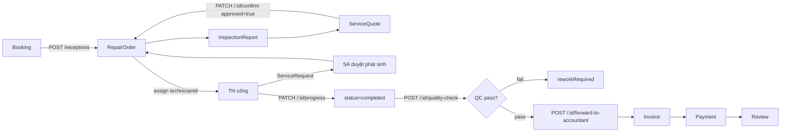

# ĐỐI CHIẾU NGHIỆP VỤ CHUẨN ↔ CODEBASE HIỆN TẠI

> **Tài liệu chuẩn đối chiếu:** [NGHIEP_VU_GARA_OTO.md](docs/NGHIEP_VU_GARA_OTO.md)
> **Codebase:** `backend/` (Node.js + Express + Mongoose) và `frontend/` (React + TypeScript + Vite)
> **Nhánh:** `HuynhNMHE187232` · **Ngày đối chiếu:** 23/07/2026
> **Phương pháp:** đọc trực tiếp toàn bộ `backend/src/models`, `backend/src/routes`, các service trọng yếu, và bảng route frontend (`frontend/src/app/App.tsx`). Mọi kết luận đều có dẫn chứng `file:line`.

---

## THANG ĐÁNH GIÁ

| Ký hiệu | Mức | Ý nghĩa |
|:-------:|-----|---------|
| ✅ | **TỐT** | Đúng nghiệp vụ chuẩn, dùng được ngay, không cần sửa |
| 🟡 | **TẠM ĐƯỢC** | Chạy được, đủ cho demo/đồ án, nhưng thiếu chiều sâu hoặc thiếu ràng buộc — cần bổ sung chứ không cần đập đi |
| 🟠 | **CẦN THAY THẾ** | Có code nhưng thiết kế sai hướng; phải làm lại phần đó thì mới đúng nghiệp vụ |
| 🔴 | **SAI HOÀN TOÀN** | Vi phạm nguyên tắc nghiệp vụ/pháp lý, hoặc tạo ra dữ liệu sai — phải sửa trước khi dùng thật |
| ⚫ | **CHƯA CÓ** | Nghiệp vụ chuẩn yêu cầu nhưng codebase hoàn toàn không có |

---

## PHẦN A — TÓM TẮT ĐIỀU HÀNH

### A.1. Bảng điểm tổng thể theo 17 nhóm nghiệp vụ

| # | Nghiệp vụ | Mức độ đáp ứng | Đánh giá chính |
|---|-----------|:--------------:|----------------|
| 01 | Khách hàng & Hồ sơ xe | ~55% | 🟡 Có đủ trường cơ bản, nhưng xe gắn cứng 1 chủ, VIN không phải khóa, không có lịch sử odometer |
| 02 | Đặt lịch & Hoạch định năng lực | ~60% | 🟡 Chống overbooking tốt bằng unique index, nhưng năng lực tính theo "chỗ ngồi" chứ không theo giờ công |
| 03 | Tiếp nhận xe | ~65% | 🟡 Validate VIN/biển số/odo rất chắc, nhưng thiếu walk-around, ảnh, tài sản trên xe, chữ ký |
| 04 | Kiểm tra & Chẩn đoán (DVI) | ~55% | 🟡 Có checklist 3 trạng thái ok/monitor/repair — đúng hướng; thiếu ảnh theo từng mục, đo lường, gửi khách |
| 05 | Báo giá & Phê duyệt | ~40% | 🔴 **Không có versioning, không lưu vết ai/khi nào/kênh nào duyệt, không duyệt một phần** |
| 06 | Lệnh sửa chữa (RO) | ~45% | 🟠 Thiếu số hiệu RO, thiếu job type, state machine quá nghèo (5 trạng thái) |
| 07 | Phụ tùng & Kho | ~10% | 🔴 **Catalog CRUD cô lập — `stockQuantity` không bao giờ bị trừ** |
| 08 | Thi công & Giám sát | ~50% | 🟡 Có per-line progress, step note kèm ảnh, transfer request; thiếu clock on/off, thiếu 3C |
| 09 | QC & Nghiệm thu | ~45% | 🔴 **QC không phải cổng chặn — hóa đơn xuất được cho đơn chưa từng QC** |
| 10 | Bàn giao, Thanh toán, Hóa đơn | ~45% | 🟠 Thanh toán từng phần tốt; nhưng không có số hóa đơn, không có MST, không có HĐĐT |
| 11 | Bảo hành dịch vụ & Comeback | 0% | ⚫ **Không tồn tại** |
| 12 | CSKH sau dịch vụ & Nhắc lịch | ~20% | 🟠 Chỉ có review; không có follow-up 72h, không có reminder engine, không có deferred work |
| 13 | Bảo hiểm | 0% | ⚫ **Không tồn tại** |
| 14 | Kế toán, Công nợ, Dòng tiền | ~30% | 🟠 Có payment + revenue report; không có giá vốn, không có lãi gộp, không có công nợ/tuổi nợ |
| 15 | Nhân sự & Năng suất thợ | ~25% | 🟠 Có technician performance theo số đơn; không có giờ công nên không tính được Productivity/Efficiency |
| 16 | Báo cáo & KPI | ~30% | 🟠 Có doanh thu theo dịch vụ/thợ/phương thức; thiếu toàn bộ KPI ngành (ELR, ARO, comeback, carry-over) |
| 17 | Phân quyền & Kiểm soát nội bộ | ~50% | 🟠 RBAC theo route rõ ràng; audit log chỉ 3 hành động, không tách trách nhiệm QC |
| — | **Tuân thủ pháp lý VN** | ~15% | 🔴 Chưa đáp ứng yêu cầu hóa đơn theo NĐ 123/2020 + NĐ 70/2025 |

**Mức độ đáp ứng trung bình có trọng số: ~38%**

### A.2. Bản đồ nghiệp vụ: chuẩn ↔ code

```
CHUẨN (7 bước Toyota)          CODE HIỆN TẠI                          TRẠNG THÁI
─────────────────────          ─────────────────────────────          ──────────
1. Appointments        →   Booking (slot + seatNo)                    🟡 có
2. Reception           →   POST /receptions → RepairOrder             🟡 có
3. RO Compilation      →   InspectionReport → ServiceQuote → RO       🔴 thiếu vết duyệt
4. Dispatch/Production →   technicianId + services[].status           🟡 thiếu giờ công
   └ Change Order      →   ServiceRequest (SA duyệt thay khách)       🔴 sai chủ thể duyệt
5. Quality Control     →   POST /:id/quality-check                    🔴 không phải cổng chặn
6. Delivery            →   forward-to-accountant → Invoice → Payment  🟠 thiếu bàn giao xe
7. Follow-Up           →   Review                                     🟠 thiếu 90%

LUỒNG VẬT TƯ           →   Part (CRUD cô lập)                         🔴 đứt hoàn toàn
LUỒNG TIỀN             →   Invoice + Payment (không có giá vốn)       🟠 nửa vời
```

> **Kết luận cốt lõi:** hệ thống đã dựng đúng **xương sống luồng công việc** (Job flow) từ đặt lịch tới thanh toán — đây là điểm mạnh thật sự. Nhưng trong ba luồng của một gara, **Luồng Vật tư gần như không tồn tại** và **Luồng Tiền thiếu vế giá vốn**, nên hệ thống hiện chưa trả lời được câu hỏi quan trọng nhất của chủ gara: *"Xe này lãi bao nhiêu?"*

---

## PHẦN B — BẢN ĐỒ CODEBASE HIỆN TẠI

### B.1. Thực thể dữ liệu (21 model)

| Model | File | Vai trò trong nghiệp vụ |
|-------|------|-------------------------|
| `User` | [user.model.js](backend/src/models/user.model.js) | 6 vai trò: onlineCustomer, walkInCustomer, serviceAdvisor, technician, accountant, admin |
| `Vehicle` | [vehicle.model.js](backend/src/models/vehicle.model.js) | Hồ sơ xe, gắn 1 `customerId` |
| `Booking` | [booking.model.js](backend/src/models/booking.model.js) | Lịch hẹn theo ngày + slot giờ + seatNo |
| `BookingHistory` | [booking-history.model.js](backend/src/models/booking-history.model.js) | Lịch sử thay đổi lịch hẹn |
| `InspectionReport` | [inspection-report.model.js](backend/src/models/inspection-report.model.js) | Kiểm tra xe, checklist 3 trạng thái |
| `ServiceQuote` | [service-quote.model.js](backend/src/models/service-quote.model.js) | Báo giá |
| `RepairOrder` | [repair-order.model.js](backend/src/models/repair-order.model.js) | **Chứng từ trung tâm** |
| `ServiceRequest` | [service-request.model.js](backend/src/models/service-request.model.js) | Đề xuất phát sinh của KTV |
| `TransferRequest` | [transfer-request.model.js](backend/src/models/transfer-request.model.js) | Chuyển việc giữa các KTV |
| `Invoice` | [invoice.model.js](backend/src/models/invoice.model.js) | Hóa đơn |
| `Payment` | [payment.model.js](backend/src/models/payment.model.js) | Thanh toán |
| `Part` | [part.model.js](backend/src/models/part.model.js) | Danh mục phụ tùng |
| `Service` / `ServiceCategory` | [service.model.js](backend/src/models/service.model.js) | Danh mục dịch vụ |
| `Schedule` | [schedule.model.js](backend/src/models/schedule.model.js) | Lịch/tải KTV theo ngày |
| `RevenueReport` | [revenue-report.model.js](backend/src/models/revenue-report.model.js) | Báo cáo doanh thu |
| `AuditLog` | [audit-log.model.js](backend/src/models/audit-log.model.js) | Nhật ký (chỉ 3 hành động) |
| `Review`, `Notification`, `Otp`, `LookupSession` | | CSKH, thông báo, xác thực |

### B.2. Luồng chính đã implement



### B.3. Phân quyền theo route (đã kiểm chứng)

| Nhóm route | Quyền |
|------------|-------|
| `/receptions`, `/quotations`, `/advisor` | `serviceAdvisor`, `admin` |
| `/repair-orders/:id/quality-check`, `/forward-to-accountant` | `serviceAdvisor`, `admin` |
| `/repair-orders/:id/progress`, `/step-notes` | `technician` (+ SA/admin) |
| `/invoices`, `/payments` | `accountant`, `admin` |
| `/admin/parts` | **`admin` duy nhất** |
| `/admin/reports/*`, `/admin/stats/*` | `admin`, `accountant` |

---

## PHẦN C — CHECKLIST ĐỐI CHIẾU CHI TIẾT

---

## ✅ PHẦN C1 — ĐIỂM TỐT (giữ nguyên, không cần sửa)

| # | Hạng mục | Bằng chứng | Vì sao là điểm tốt |
|---|----------|------------|---------------------|
| G1 | **Chống overbooking bằng unique partial index ở tầng DB** | [booking.model.js:108-111](backend/src/models/booking.model.js#L108-L111) | Đây là cách làm **đúng chuẩn**: ràng buộc `{bookingDate, timeSlot, seatNo}` unique với `partialFilterExpression: {occupiesSlot:true}` khiến hai request đồng thời **không thể** cùng chiếm một chỗ. Rất nhiều hệ thống thương mại vẫn kiểm tra bằng `count()` ở tầng ứng dụng và bị race condition. |
| G2 | **Đánh index cho đường đọc nóng nhất, có giải thích rõ** | [booking.model.js:89](backend/src/models/booking.model.js#L89) | Compound index `{bookingDate, timeSlot, status}` đúng thứ tự Equality-first. |
| G3 | **Kiểm tra dữ liệu tiếp nhận rất chặt** | [reception.service.js](backend/src/services/reception.service.js) | VIN bắt buộc **17 ký tự, loại trừ I/O/Q** — đúng chuẩn ISO 3779. SĐT, biển số, model, odometer đều bắt buộc. Vượt trên mặt bằng đồ án. |
| G4 | **Checklist kiểm tra dùng 3 trạng thái `ok / monitor / repair`** | [inspection-report.model.js:34](backend/src/models/inspection-report.model.js#L34) | Trùng khớp chuẩn DVI 3 màu 🟢🟡🔴 của ngành. Nền móng đúng để phát triển tiếp. |
| G5 | **Tách `kind: service / part / labor` trên dòng báo giá, dòng RO và dòng hóa đơn** | [service-quote.model.js:17](backend/src/models/service-quote.model.js#L17), [repair-order.model.js:41](backend/src/models/repair-order.model.js#L41), [invoice.model.js:21](backend/src/models/invoice.model.js#L21) | Đây là điều kiện **cần** để sau này tách được doanh thu nhân công vs phụ tùng — nhiều hệ thống bỏ qua và không bao giờ sửa được. |
| G6 | **Trường `source: quote / additionalService` trên dòng RO và hóa đơn** | [repair-order.model.js:50](backend/src/models/repair-order.model.js#L50) | Giải thích được vì sao tổng tiền lớn hơn báo giá gốc. Đúng tinh thần minh bạch của Change Order. |
| G7 | **Snapshot giá tại thời điểm (`priceAtTime`) và snapshot tên KH/xe trên báo giá** | [repair-order.model.js:29](backend/src/models/repair-order.model.js#L29), [service-quote.model.js:53-56](backend/src/models/service-quote.model.js#L53-L56) | Chứng từ vẫn đọc đúng kể cả khi danh mục giá hoặc hồ sơ KH thay đổi sau này. |
| G8 | **Đồng bộ chiết khấu/thuế từ báo giá sang RO sang hóa đơn** | [repair-order.model.js:143-157](backend/src/models/repair-order.model.js#L143-L157), [invoice.model.js:93-99](backend/src/models/invoice.model.js#L93-L99) | Hóa đơn luôn đối chiếu ngược được với báo giá gốc (`quoteId`, `quotedTotal`). |
| G9 | **Tiến độ theo từng dòng công việc** | [repair-order.model.js:59-63](backend/src/models/repair-order.model.js#L59-L63) | KTV hoàn thành từng hạng mục mà không làm cả đơn nhảy sang "completed". Đúng mô hình RO Line của chuẩn. |
| G10 | **Ghi chú thi công kèm ảnh minh chứng của KTV** | [repair-order.model.js:88-91](backend/src/models/repair-order.model.js#L88-L91) | Tách bạch ảnh thi công với ảnh kiểm tra ban đầu — đúng ý đồ bằng chứng cho QC. |
| G11 | **Thanh toán từng phần đúng chuẩn** | [invoice.model.js:71-80](backend/src/models/invoice.model.js#L71-L80) | Có `amountPaid` + trạng thái `partiallyPaid`. Xử lý được đặt cọc. |
| G12 | **`Invoice.repairOrderId` là `unique`** | [invoice.model.js:41](backend/src/models/invoice.model.js#L41) | Chặn xuất hai hóa đơn cho cùng một lệnh sửa chữa ở tầng DB. |
| G13 | **Chống trùng thao tác nghiệp vụ bằng cờ thời điểm** | [repair-order.service.js:615](backend/src/services/repair-order.service.js#L615) | `forwardedToAccountantAt` chặn forward hai lần (409). Cùng tinh thần với `TERMINAL_STATUSES` ở [additional-service.service.js](backend/src/services/additional-service.service.js). |
| G14 | **Nghiệp vụ chuyển việc giữa KTV có phê duyệt** | [transfer-request.model.js](backend/src/models/transfer-request.model.js) | Không nằm trong chuẩn tối thiểu nhưng là nghiệp vụ **thật** của xưởng. Điểm cộng. |
| G15 | **Kiến trúc phân lớp sạch và nhất quán** | `routes → controllers → services → repositories → models` + `validators/` | Dễ chèn thêm nghiệp vụ mới mà không phá vỡ cấu trúc. |
| G16 | **RBAC khai báo ngay tại route** | ví dụ [repair-order.routes.js:53](backend/src/routes/repair-order.routes.js#L53) | Đọc file route là biết ai được làm gì — dễ audit. |
| G17 | **Tra cứu tiến độ công khai cho khách vãng lai** | [tracking.service.js:147](backend/src/services/tracking.service.js#L147) | Khách walk-in không có tài khoản vẫn tra được bằng biển số + SĐT. Đúng nhu cầu thực tế VN. |
| G18 | **Gửi email không chặn request (fire-and-forget)** | [quotation.service.js](backend/src/services/quotation.service.js) | Không để "Gửi báo giá" treo vì SMTP chậm; đồng thời trả về `hasEmailOnFile` để SA biết thật sự có gửi được hay không. Xử lý rất chín. |
| G19 | **Comment giải thích "vì sao" chứ không phải "cái gì"** | toàn bộ `models/` | Chất lượng tài liệu hóa nội bộ cao hơn hẳn mặt bằng chung. |

---

## 🟡 PHẦN C2 — ĐIỂM TẠM ĐƯỢC (dùng được, cần bổ sung chứ không phải làm lại)

| # | Hạng mục | Hiện trạng | Thiếu so với chuẩn | Bằng chứng |
|---|----------|------------|--------------------|------------|
| A1 | **Hồ sơ xe** | Có `licensePlate` (unique), `chassisNumber`, `engineNumber`, `brand`, `model`, `year`, `color`, `lastKnownMileage` | Thiếu: hạn đăng kiểm, hạn bảo hiểm, ngày bán, hạn bảo hành hãng, loại nhiên liệu/hộp số, ảnh xe | [vehicle.model.js](backend/src/models/vehicle.model.js) |
| A2 | **Hồ sơ khách hàng** | `fullName`, `email`, `phone`, `accountType`, `lookupCode` cho walk-in | Thiếu: MST + địa chỉ xuất hóa đơn, nhóm giá, hạn mức công nợ, đồng ý nhận thông báo, nguồn khách | [user.model.js](backend/src/models/user.model.js) |
| A3 | **Đặt lịch** | Slot cố định 08:00–16:00, `SLOT_CAPACITY = 5`, có `rescheduled`, có `BookingHistory` | Thiếu: trạng thái `noShow`, nhắc lịch trước 24h, đặt trước phụ tùng, kiểm tra kỹ năng KTV | [constants.js](backend/src/config/constants.js) |
| A4 | **Tiếp nhận** | Bắt buộc VIN/biển số/model/SĐT/odometer, có `issueDescription` và `promisedAt` | Thiếu: ảnh walk-around, sơ đồ hư hại, mức nhiên liệu lúc vào, kiểm kê tài sản trên xe, **chữ ký ủy quyền** | [reception.service.js](backend/src/services/reception.service.js) |
| A5 | **Kiểm tra xe (DVI)** | `items[]` có `category/label/status/note/laborCost/partsCost`, `photos[]`, `odometer`, `fuelLevel`, `recommendedServices[]` | Ảnh ở **cấp báo cáo**, không gắn theo từng mục; thiếu số đo (mm má phanh, V ắc-quy); không gửi được cho khách xem | [inspection-report.model.js:30-40](backend/src/models/inspection-report.model.js#L30-L40) |
| A6 | **Tải kỹ thuật viên** | `Schedule` có `isAvailable`, `activeOrderIds`, `activeOrderCount` | Đếm **số đơn** thay vì **giờ công**; không biết KTV nào rảnh mấy giờ | [schedule.model.js](backend/src/models/schedule.model.js) |
| A7 | **Ghi chú thi công** | `stepNotes[]` có nội dung + ảnh + `stepIndex` | Chưa cấu trúc hóa thành **3C (Complaint / Cause / Correction)** — chuẩn hồ sơ bảo hành | [repair-order.model.js:68-98](backend/src/models/repair-order.model.js#L68-L98) |
| A8 | **Danh mục dịch vụ** | `name`, `category`, `basePrice`, `estimatedDuration`, `isActive` | Có `estimatedDuration` (phút) là nền tốt, nhưng chưa dùng làm **định mức giờ công tính tiền**; chưa có giá theo model xe | [service.model.js](backend/src/models/service.model.js) |
| A9 | **Thanh toán** | 4 phương thức, `reference` để đối chiếu sao kê, `status`, `paidAt` | Thiếu: chốt quỹ theo ca, hoàn tiền/ghi giảm có kiểm soát, thanh toán ba bên (bảo hiểm) | [payment.model.js](backend/src/models/payment.model.js) |
| A10 | **Báo cáo doanh thu** | `byService`, `byTechnician`, `byPaymentMethod`, `totalRevenue/Orders/Invoices` | Chỉ có **doanh thu**, không có **giá vốn** nên không ra được lãi gộp — vì `Part` không có giá vốn | [revenue-report.model.js](backend/src/models/revenue-report.model.js) |
| A11 | **Thông báo** | In-app + email, có `notifyRole` | Chưa có SMS/Zalo — kênh chủ đạo tại VN | [notification.service.js](backend/src/services/notification.service.js) |
| A12 | **Hiệu suất KTV** | `getTechnicianPerformance` theo số đơn + `completionRate` + `avgTime` | `avgTime` tính từ `startedAt/completedAt` của cả đơn, **không phải giờ công thực** → không ra được Productivity/Efficiency chuẩn ngành | [admin.service.js:352](backend/src/services/admin.service.js#L352) |
| A13 | **Trạng thái dòng RO** | `pending / inProgress / completed` | Thiếu `paused` + lý do tạm dừng (chờ phụ tùng / chờ khách) | [repair-order.model.js:14](backend/src/models/repair-order.model.js#L14) |

---

## 🟠 PHẦN C3 — ĐIỂM CẦN THAY THẾ (thiết kế sai hướng, phải làm lại phần đó)

### R1 — State machine của RepairOrder quá nghèo

**Hiện trạng:** chỉ 5 trạng thái — `pending`, `inProgress`, `completed`, `reworkRequired`, `cancelled`
📍 [repair-order.model.js:3-9](backend/src/models/repair-order.model.js#L3-L9)

**Chuẩn yêu cầu:** tối thiểu phải phân biệt được `WAITING_PARTS`, `WAITING_CUSTOMER`, `ON_HOLD`, `READY_FOR_DELIVERY`, `DELIVERED`, `CLOSED`.

**Hậu quả cụ thể:**
- Một xe nằm 3 ngày chờ phụ tùng và một xe nằm 3 ngày vì thợ quên — hệ thống ghi **giống hệt nhau** (`inProgress`). Không ai truy được nguyên nhân xe tồn.
- Thời gian chờ khách duyệt phát sinh bị tính vào thời gian thi công → chỉ số hiệu suất KTV **sai một cách có hệ thống**.
- Không có `DELIVERED` → hệ thống **không biết xe đã thực sự giao cho khách hay chưa**. `invoicedAt` là mốc cuối cùng, nhưng "đã xuất hóa đơn" ≠ "đã giao xe".
- Không có `CLOSED` → không có ranh giới bất biến của chứng từ.

**Cần thay bằng:** mở rộng enum + thêm collection `RepairOrderStatusHistory` (`from`, `to`, `by`, `at`, `reason`) — xem [NGHIEP_VU_GARA_OTO.md §8.4](docs/NGHIEP_VU_GARA_OTO.md).

---

### R2 — RepairOrder và Invoice không có số hiệu chứng từ

**Hiện trạng:** không tồn tại trường `code` / `orderNumber` / `invoiceNumber` trên cả `RepairOrder` lẫn `Invoice` (đã grep toàn repo — không có kết quả). Chỉ `ServiceQuote` có `code`.
📍 [repair-order.model.js](backend/src/models/repair-order.model.js), [invoice.model.js](backend/src/models/invoice.model.js)

**Chuẩn yêu cầu:** Toyota (S1 Step 3) yêu cầu RO phải được **đánh số tuần tự có kiểm soát**; hóa đơn VN bắt buộc có ký hiệu + số.

**Hậu quả:** khách gọi điện không đọc được mã đơn; nhân viên phải tra bằng ObjectId 24 ký tự; không đối chiếu được với chứng từ giấy; không đáp ứng yêu cầu hóa đơn.

**Cần thay bằng:** sinh mã có định dạng nghiệp vụ `RO-YYYYMM-#####`, `INV-YYYYMM-#####`, unique index, sinh atomic bằng counter collection.

---

### R3 — RepairOrder không có Job Type (ai trả tiền)

**Hiện trạng:** không có trường phân loại nguồn chi trả. Mọi RO đều mặc định khách tự trả.
📍 [repair-order.model.js:100-192](backend/src/models/repair-order.model.js#L100-L192)

**Chuẩn yêu cầu:** `CustomerPay / Warranty / Internal / Insurance / Goodwill`, và cho phép **nhiều job type trên các dòng khác nhau** của cùng một RO (split-pay).

**Hậu quả:** không làm được xe bảo hành, không làm được xe bảo hiểm, và **không tách được chi phí sửa lại do lỗi của gara** ra khỏi doanh thu → báo cáo lãi bị thổi phồng.

**Cần thay bằng:** thêm `jobType` ở cấp `orderServiceSchema` (từng dòng) + tổng hợp lên cấp RO.

---

### R4 — Không có ghi nhận giờ công (clock on/off)

**Hiện trạng:** chỉ có `startedAt` / `completedAt` ở cấp toàn đơn, một `technicianId` duy nhất.
📍 [repair-order.model.js:112-117](backend/src/models/repair-order.model.js#L112-L117), [repair-order.model.js:171-176](backend/src/models/repair-order.model.js#L171-L176)

**Chuẩn yêu cầu:** clock-on/clock-off theo **từng RO Line**, nhiều KTV có thể tham gia một đơn, thời gian `WAITING_*` không tính vào giờ công.

**Hậu quả:** ba KPI nền tảng của ngành — **Productivity, Efficiency, Effective Labor Rate** — đều **không thể tính được**. Không trả lương theo sản lượng được. Không biết định mức giờ công đặt đúng hay sai.

**Cần thay bằng:** collection `TimeLog` (`repairOrderId`, `lineIndex`, `technicianId`, `startedAt`, `endedAt`, `pauseReason`).

---

### R5 — ServiceQuote không có versioning và không lưu vết phê duyệt

**Hiện trạng:** `confirmQuotation(id, approved)` chỉ set `quote.status = "approved" | "rejected"`. **Không lưu ai duyệt, lúc nào, qua kênh nào.** Sửa báo giá là ghi đè trực tiếp lên document cũ.
📍 [quotation.service.js — confirmQuotation](backend/src/services/quotation.service.js), [service-quote.model.js:77-81](backend/src/models/service-quote.model.js#L77-L81)

**Chuẩn yêu cầu (S6 — bắt buộc):** phải ghi nhận **ngày giờ, tên người phê duyệt, số điện thoại/email đã liên hệ, và mô tả đầy đủ nội dung được duyệt**.

**Hậu quả:** khi khách khiếu nại "tôi không đồng ý cái này", gara **không có bằng chứng nào**. Đây là rủi ro pháp lý thực sự, không phải rủi ro kỹ thuật.

**Cần thay bằng:** `QuoteVersion` (snapshot bất biến) + `QuoteApproval` (`approvedBy`, `approvedAt`, `channel`, `contactValue`, `snapshotHash`).

---

### R6 — Không có "duyệt một phần" (Partially Approved) và không có Deferred Work

**Hiện trạng:** `confirmQuotation` nhận **một boolean** `approved` cho **toàn bộ** báo giá.
📍 [quotation.service.js](backend/src/services/quotation.service.js)

**Chuẩn yêu cầu:** khách duyệt hạng mục A, B, từ chối C → C phải trở thành **Deferred Work** gắn với xe và được nhắc lại lần sau.

**Hậu quả:** thực tế khách hầu như **luôn** duyệt một phần. Hiện SA sẽ phải sửa tay báo giá rồi duyệt lại — mất dấu vết hạng mục bị từ chối, và mất luôn nguồn doanh thu quay lại (theo chuẩn ngành đây là một trong những nguồn doanh thu có tỷ lệ chuyển đổi cao nhất).

---

### R7 — Vehicle gắn cứng một chủ sở hữu, VIN không phải khóa

**Hiện trạng:** `Vehicle.customerId` là ref bắt buộc, một-một. `licensePlate` unique; `chassisNumber` (VIN) **không** unique, **không** bắt buộc ở tầng schema.
📍 [vehicle.model.js:5-24](backend/src/models/vehicle.model.js#L5-L24)

**Chuẩn yêu cầu:** VIN là khóa định danh xe; quan hệ chủ–xe là nhiều-nhiều theo thời gian (`vehicle_ownership` có `from_date`/`to_date`).

**Hậu quả:** xe đổi chủ → hoặc mất lịch sử, hoặc lịch sử của chủ cũ bị gán sang chủ mới. Xe đổi biển số (đổi tỉnh, chuyển sang biển vàng) → tạo bản ghi trùng.

**Lưu ý:** tầng service ở reception **có** bắt buộc VIN 17 ký tự ([reception.service.js](backend/src/services/reception.service.js)) — tốt, nhưng ràng buộc chỉ nằm ở một đường vào, tầng dữ liệu vẫn hở.

---

### R8 — Odometer chỉ lưu giá trị mới nhất, có thể ghi lùi

**Hiện trạng:** `Vehicle.lastKnownMileage` là một số duy nhất, bị ghi đè mỗi lần tiếp nhận.
📍 [vehicle.model.js:43-46](backend/src/models/vehicle.model.js#L43-L46), [reception.service.js:152](backend/src/services/reception.service.js#L152)

**Chuẩn yêu cầu:** lịch sử odometer theo thời gian; odometer chỉ được tăng, nhập lùi phải cảnh báo + ghi log.

**Hậu quả:** không tính được số km/tháng → không nhắc bảo dưỡng đúng lúc; không phát hiện được tua công-tơ-mét; không xác định được xe còn hạn bảo hành theo km hay không.

---

### R9 — Audit log chỉ bao phủ 3 hành động kế toán

**Hiện trạng:** `AUDIT_ACTIONS = ["invoiceGenerated", "invoiceSent", "paymentRecorded"]`
📍 [audit-log.model.js:3](backend/src/models/audit-log.model.js#L3)

**Chuẩn yêu cầu:** audit bất biến cho **thay đổi giá, giảm giá, sửa/xóa dòng RO, mở lại RO, điều chỉnh kho, hủy hóa đơn, đổi quyền người dùng**.

**Hậu quả:** SA có thể sửa giá dòng báo giá, admin có thể sửa `stockQuantity` phụ tùng, admin có thể đổi vai trò người dùng — **không để lại dấu vết nào**. Đây chính là các điểm gian lận nội bộ phổ biến nhất trong ngành gara.

---

### R10 — Kế toán không có giá vốn nên không có lãi gộp

**Hiện trạng:** `Part` chỉ có `unitPrice` (giá bán). Không có `costPrice`. `RevenueReport` chỉ tổng hợp doanh thu.
📍 [part.model.js:17-21](backend/src/models/part.model.js#L17-L21), [revenue-report.model.js](backend/src/models/revenue-report.model.js)

**Chuẩn yêu cầu:** lãi gộp phải tách theo **nhân công / phụ tùng / thuê ngoài** vì ba dòng này có cấu trúc lợi nhuận hoàn toàn khác nhau.

**Hậu quả:** chủ gara nhìn báo cáo chỉ thấy doanh thu, **không biết mình lãi bao nhiêu**, và không biết nên đẩy dịch vụ nào.

---

### R11 — Không có công nợ và tuổi nợ

**Hiện trạng:** `Invoice` có `dueAt` và `status`, nhưng không có báo cáo tổng hợp công nợ theo khách, không có aging (0–30 / 31–60 / 61–90 / >90 ngày), không có hạn mức công nợ trên khách hàng.
📍 [invoice.model.js](backend/src/models/invoice.model.js), [invoice.service.js:170](backend/src/services/invoice.service.js#L170)

**Hậu quả:** với khách doanh nghiệp/đội xe (và sau này là bảo hiểm — nợ 30–90 ngày là bình thường), gara sẽ mất kiểm soát dòng tiền.

---

### R12 — CSKH sau dịch vụ mới chỉ có Review

**Hiện trạng:** có `Review` do khách chủ động viết.
📍 [review.model.js](backend/src/models/review.model.js)

**Chuẩn yêu cầu (S1 Step 7):** chính sách follow-up bằng văn bản, **liên hệ trong 72 giờ**, sổ theo dõi phản hồi, khảo sát 5–6 câu, phân loại khiếu nại theo 7 nhóm, theo đến cùng với khách không hài lòng.

**Hậu quả:** thiếu hẳn bước 7 của quy trình chuẩn — bước có ảnh hưởng lớn nhất tới tỷ lệ khách quay lại.

---

## 🔴 PHẦN C4 — ĐIỂM SAI HOÀN TOÀN (phải sửa trước khi dùng thật)

### ❌ W1 — Quản lý kho phụ tùng: `stockQuantity` KHÔNG BAO GIỜ bị trừ

**Mức độ: NGHIÊM TRỌNG NHẤT**

**Bằng chứng (đã grep toàn bộ `backend/src`):**
```
stockQuantity xuất hiện tại:
  models/part.model.js:22          ← khai báo schema
  services/part.service.js:29,39,48 ← createPart
  services/part.service.js:58,86,87,90 ← updatePart (admin gõ tay)
→ KHÔNG có ở bất kỳ file nào thuộc luồng quotation / repair-order / invoice.

PartModel được tham chiếu tại:
  models/part.model.js  ·  repositories/part.repository.js
→ KHÔNG có service nghiệp vụ nào dùng đến.
```
📍 [part.model.js](backend/src/models/part.model.js), [part.service.js](backend/src/services/part.service.js)

**Vì sao là SAI HOÀN TOÀN, không phải "thiếu tính năng":**

1. **Dòng phụ tùng trên báo giá không tham chiếu tới `Part`.** `quoteLineSchema` chỉ có `serviceId` (ref `Service`) — không có `partId`. Một dòng `kind: "part"` chỉ là **chữ do SA gõ tay** kèm giá gõ tay.
   📍 [service-quote.model.js:10-22](backend/src/models/service-quote.model.js#L10-L22)
2. Do đó khi RO hoàn tất và hóa đơn xuất ra, **tồn kho hệ thống không đổi**. Bán 50 lọc dầu, hệ thống vẫn báo tồn nguyên.
3. Không có `InventoryTransaction`, không có phiếu xuất kho, không có giữ chỗ (reservation), không có kiểm kê.
4. Trạng thái `WAITING_PARTS` cũng không thể tồn tại vì hệ thống không biết phụ tùng nào thiếu.
5. Chỉ `admin` được vào `/admin/parts` ([part.routes.js:8](backend/src/routes/part.routes.js#L8)) — nhưng người thực sự xuất phụ tùng trong gara là **thủ kho / nhân viên phụ tùng**, vai trò này **không tồn tại** trong `USER_ROLES`.

**So với chuẩn:** đây là **Luồng Vật tư** — một trong ba luồng bắt buộc của gara ([NGHIEP_VU_GARA_OTO.md §1.3](docs/NGHIEP_VU_GARA_OTO.md)). Hiện tại luồng này **đứt hoàn toàn**. Đây cũng là lỗi số 5 trong [Phụ lục A — 20 lỗi phổ biến nhất](docs/NGHIEP_VU_GARA_OTO.md).

---

### ❌ W2 — QC không phải cổng chặn: hóa đơn xuất được cho đơn CHƯA TỪNG kiểm tra chất lượng

**Mức độ: NGHIÊM TRỌNG**

**Bằng chứng:**
- KTV hoàn tất → `order.status = "completed"`.
- `submitQualityCheck(passed: true)` **không đổi trạng thái** — chỉ set `completedAt` và push một `stepNote` dạng `"[QC pass] ..."`.
  📍 [repair-order.service.js:555-557](backend/src/services/repair-order.service.js#L555-L557)
- `generateInvoiceFromRepairOrder` chỉ kiểm tra `if (order.status !== "completed")`.
  📍 [invoice.service.js:245](backend/src/services/invoice.service.js#L245)

⇒ **Một đơn vừa được KTV bấm "hoàn thành" đã đủ điều kiện xuất hóa đơn.** QC là bước hoàn toàn **tùy chọn** ở tầng dữ liệu; nó chỉ "bắt buộc" ở tầng giao diện, mà giao diện thì bỏ qua được bằng cách gọi API trực tiếp.

**Chuẩn yêu cầu (S1 Step 5, S7, S10, BR-RO-05):** *"Không được xuất hóa đơn nếu RO chưa QC-pass"* — và xe hoàn tất **phải** được kiểm bởi KTV bậc cao hoặc quản lý xưởng trước khi chuyển sang khu bàn giao.

**Vấn đề kèm theo — không tách trách nhiệm:** `POST /:id/quality-check` cho phép `serviceAdvisor` và `admin`
📍 [repair-order.routes.js:126-129](backend/src/routes/repair-order.routes.js#L126-L129).
Không có kiểm tra `reviewerId !== order.technicianId`, và **không có vai trò QC/tổ trưởng** trong `USER_ROLES`. Chuẩn BR-QC-01 yêu cầu chặn cứng "người QC ≠ người làm".

**Cách sửa tối thiểu:** thêm trạng thái `qcPassed` (hoặc trường `qcPassedAt` + `qcBy`), và `generateInvoiceFromRepairOrder` phải kiểm tra trường đó chứ không phải `status === "completed"`.

---

### ❌ W3 — Phát sinh được duyệt bởi Cố vấn dịch vụ, KHÔNG PHẢI khách hàng

**Mức độ: NGHIÊM TRỌNG — rủi ro pháp lý**

**Bằng chứng:**
- `PATCH /additional-service-proposals/:id` yêu cầu quyền `serviceAdvisor` hoặc `admin`.
  📍 [additional-service.routes.js:26-29](backend/src/routes/additional-service.routes.js#L26-L29)
- Khi SA đặt `status = "approved"`, hệ thống **lập tức** push dòng công việc lên RO và cộng vào `totalCost`.
  📍 [additional-service.service.js — nhánh `if (status === "approved")`](backend/src/services/additional-service.service.js)
- Không có bước nào giữa `sent` và `approved` để **khách** phản hồi. Email gửi khách ghi *"Please log in to your account to approve or decline it"* nhưng **không tồn tại endpoint nào cho khách duyệt** — đã grep: không có route nào cho `onlineCustomer` trên `additional-service`.
- Các trạng thái `approvedByCustomer` / `rejectedByCustomer` **có khai báo trong enum nhưng chưa được dùng ở bất kỳ đâu**.
  📍 [service-request.model.js:15-16](backend/src/models/service-request.model.js#L15-L16)

**Chuẩn yêu cầu (S6 — quy định pháp lý):**
> Trước khi phát sinh **bất kỳ chi phí nhân công hoặc phụ tùng nào vượt quá giá đã báo và đã được duyệt**, gara phải lập phiếu công việc sửa đổi, nêu chi phí bổ sung **và tổng chi phí mới**, liên hệ khách hàng, và **ghi nhận phê duyệt kèm ngày giờ, tên người phê duyệt, số điện thoại/email đã liên hệ**.

**Hậu quả:** hóa đơn cuối cùng có thể cao hơn báo giá đã duyệt mà **khách chưa từng đồng ý**, và hệ thống **không có bằng chứng ngược lại**. Đây đúng là lỗi số 1 trong [Phụ lục A](docs/NGHIEP_VU_GARA_OTO.md).

**Đồng thời cũng thiếu:** báo giá bổ sung không hiển thị **tổng chi phí mới sau điều chỉnh** — chuẩn bắt buộc phải nêu con số này, không chỉ nêu phần chênh.

---

### ❌ W4 — Hóa đơn không đáp ứng yêu cầu pháp lý Việt Nam

**Mức độ: NGHIÊM TRỌNG (nếu triển khai thật)**

| Yêu cầu pháp lý | Nguồn | Hiện trạng code |
|-----------------|-------|-----------------|
| Số + ký hiệu hóa đơn | NĐ 123/2020 | ❌ Không có trường nào |
| MST, địa chỉ xuất hóa đơn của khách | NĐ 123/2020 | ❌ `User` không có `taxCode` |
| Thông tin xe + odometer trên hóa đơn | S6 | ❌ `Invoice` không tham chiếu `Vehicle` |
| Ghi rõ phụ tùng **mới / cũ / tái chế / phục hồi** | S6 | ❌ `lineItemSchema` chỉ có `kind` |
| Tách bạch chi phí nhân công | S6 | 🟡 có `kind: labor` nhưng không tổng hợp riêng |
| Thuế GTGT theo từng dòng | NĐ 123/2020 | 🟠 chỉ có `taxAmount` ở cấp hóa đơn |
| Hóa đơn điện tử ký số, phát hành, gửi CQT | NĐ 70/2025 (từ 01/6/2025) | ❌ Không có tích hợp |
| Hóa đơn điều chỉnh / thay thế khi sai sót | NĐ 123/2020 | ❌ Chỉ có `status: "cancelled"`, không có liên kết ngược |
| Lập hóa đơn không muộn hơn ngày làm việc tiếp theo | NĐ 70/2025 | ❌ Không có kiểm soát/cảnh báo |
| Điều khoản bảo hành trên hóa đơn | Luật BVQLNTD 2023 | ❌ Không có |

📍 [invoice.model.js](backend/src/models/invoice.model.js), [user.model.js](backend/src/models/user.model.js)

---

### ❌ W5 — Không có bước Bàn giao xe

**Mức độ: CAO**

**Hiện trạng:** sau QC, luồng đi thẳng `forward-to-accountant` → `Invoice` → `Payment`. Mốc cuối cùng của `RepairOrder` là `invoicedAt`.
📍 [repair-order.model.js:177-189](backend/src/models/repair-order.model.js#L177-L189)

**Thiếu toàn bộ bước 6 của chuẩn (S1 Step 6):**
- Không có trạng thái `READY_FOR_DELIVERY` / `DELIVERED`
- Không có biên bản nghiệm thu & bàn giao, không có chữ ký khách nhận xe
- Không có ghi nhận "đã trình phụ tùng cũ đã thay"
- Không có ràng buộc **"chưa thanh toán thì chưa giao xe"** (BR-INV-04)
- Không có bước vệ sinh xe như một hạng mục có định mức (S11, S12 coi đây là bước bắt buộc tại VN)

**Hậu quả:** hệ thống **không biết xe đang ở đâu**. Một xe đã xuất hóa đơn nhưng chưa thanh toán và vẫn nằm trong xưởng — không có cách nào phân biệt với xe đã giao.

---

### ❌ W6 — Không có bảo hành dịch vụ và không có liên kết Comeback

**Mức độ: CAO**

**Bằng chứng:** grep toàn repo, từ khóa `warranty` chỉ xuất hiện trong **2 comment** ([vehicle.model.js:42](backend/src/models/vehicle.model.js#L42)) và **1 placeholder input** ([QuotationPage.tsx:1083](frontend/src/pages/advisor/QuotationPage.tsx#L1083)). `comeback` — 0 kết quả.

**Thiếu:**
- Chính sách bảo hành (tháng / km), phiếu bảo hành in kèm hóa đơn
- Trường `parentRoId` / `isComeback` trên `RepairOrder`
- Nhận diện tự động xe quay lại trong hạn bảo hành khi tiếp nhận
- Phân định trách nhiệm: lỗi tay nghề (gara chịu) / lỗi phụ tùng (đòi NCC) / lỗi khác (khách trả)
- KPI Comeback Rate

**Lưu ý:** `reworkRequired` **không phải** comeback. Đó là QC nội bộ chưa đạt **trước khi giao xe**. Comeback là khách **đã nhận xe rồi quay lại** — hai nghiệp vụ khác nhau, hiện chỉ có cái thứ nhất.

**Ràng buộc pháp lý:** Luật BVQLNTD 2023 quy định doanh nghiệp phải **thường xuyên kiểm tra chất lượng dịch vụ, bảo đảm chất lượng như đã cam kết** — không có dữ liệu bảo hành thì không thể chứng minh việc tuân thủ.

---

### ❌ W7 — Không có nghiệp vụ bảo hiểm

**Mức độ: CAO (nếu gara có làm xe bảo hiểm — thực tế hầu hết đều làm)**

**Bằng chứng:** grep `insurance` toàn repo → **0 kết quả**.

**Thiếu toàn bộ:** hồ sơ tổn thất, giám định viên, biên bản giám định, giám định bổ sung khi tháo rã, bảo lãnh thanh toán, chia chi phí BH trả / khách trả (mức miễn thường), công nợ theo công ty bảo hiểm, chia hóa đơn (split billing).

**Đặc thù bị bỏ sót:** một RO bảo hiểm có **ba bên** (Khách — Gara — Công ty BH). Mô hình hiện tại chỉ có hai bên và `Invoice.repairOrderId` là `unique` nên **về mặt cấu trúc không thể** xuất hai hóa đơn cho một RO.
📍 [invoice.model.js:41](backend/src/models/invoice.model.js#L41)

---

### ❌ W8 — Không có mua hàng, nhà cung cấp, công nợ phải trả

**Mức độ: CAO**

**Bằng chứng:** grep `supplier` → 0; `purchase` → 0.

**Thiếu:** danh mục NCC, PR → PO → nhận hàng từng phần → GRN → đối chiếu 3 chiều → công nợ phải trả; backorder liên kết ngược về RO; đặt hàng riêng cho một RO; Min-Max và đề xuất đặt hàng tự động; trả hàng/trả bảo hành NCC; core charge.

---

### ❌ W9 — Không có nhắc lịch và không có Deferred Work

**Mức độ: TRUNG BÌNH-CAO (ảnh hưởng trực tiếp doanh thu)**

**Bằng chứng:** grep `reminder` → 0; `deferred` → 0.

**Thiếu:** nhắc bảo dưỡng định kỳ theo km/thời gian, nhắc hạng mục 🟡 khách đã từ chối, nhắc hạn đăng kiểm, nhắc hạn bảo hiểm, nhắc hết hạn bảo hành, chiến dịch gọi khách lâu không quay lại.

**Điều đáng tiếc:** dữ liệu để làm việc này **đã có sẵn** — `InspectionReport.items[].status = "monitor"` chính là hạng mục 🟡, và `recommendedServices[]` chính là khuyến nghị. Chúng chỉ đang **không được lưu lại thành nghĩa vụ theo dõi** sau khi báo giá kết thúc.
📍 [inspection-report.model.js:34](backend/src/models/inspection-report.model.js#L34), [inspection-report.model.js:93-96](backend/src/models/inspection-report.model.js#L93-L96)

---

### ❌ W10 — Thiếu vai trò nghiệp vụ và tách trách nhiệm

**Mức độ: TRUNG BÌNH**

**Hiện trạng:** `USER_ROLES = [onlineCustomer, walkInCustomer, serviceAdvisor, technician, accountant, admin]`
📍 [user.model.js:3-10](backend/src/models/user.model.js#L3-L10)

| Vai trò chuẩn | Trong code | Hệ quả |
|---------------|------------|--------|
| Điều phối viên (Dispatcher/Foreman) | ❌ | SA kiêm điều phối |
| **KCS / Tổ trưởng (QC)** | ❌ | **SA tự QC — vi phạm tách trách nhiệm** |
| **Nhân viên phụ tùng / Thủ kho** | ❌ | **Chỉ admin sửa được kho** |
| Quản lý dịch vụ | ❌ | Không có cấp duyệt trung gian cho giảm giá/bảo hành |
| Lễ tân / CSKH | ❌ | Gộp vào SA |

**Kèm theo:** không có phân cấp quyền giảm giá (chuẩn: SA ≤5%, QLDV ≤15%, Chủ gara >15%) — hiện SA sửa `discountPercent` tùy ý, **không audit**.

---

## PHẦN D — TỔNG HỢP THEO 20 LỖI PHỔ BIẾN NHẤT

Đối chiếu với [Phụ lục A của tài liệu chuẩn](docs/NGHIEP_VU_GARA_OTO.md):

| # | Lỗi phổ biến | Dự án có mắc? | Ghi chú |
|---|--------------|:-------------:|---------|
| 1 | Không có Change Order đúng chuẩn | 🔴 **Có** | W3 |
| 2 | Báo giá không versioning | 🔴 **Có** | R5 |
| 3 | Thiếu `WAITING_PARTS` / `WAITING_CUSTOMER` | 🔴 **Có** | R1 |
| 4 | Không có QC gate / tự QC | 🔴 **Có** | W2 |
| 5 | Xuất kho không gắn RO / không trừ tồn | 🔴 **Có (nặng nhất)** | W1 |
| 6 | Không đóng băng giá vốn | 🔴 **Có** | Không có giá vốn |
| 7 | Không tách doanh thu nhân công vs phụ tùng | 🟡 **Một nửa** | Có `kind` nhưng chưa tổng hợp |
| 8 | Xe gắn cứng một khách hàng | 🔴 **Có** | R7 |
| 9 | Dùng biển số thay VIN làm khóa | 🔴 **Có** | R7 |
| 10 | Không lưu lịch sử odometer | 🔴 **Có** | R8 |
| 11 | Không có Deferred Work | 🔴 **Có** | W9 |
| 12 | Không có time log | 🔴 **Có** | R4 |
| 13 | Tính tiền theo giờ khai của thợ | ⚪ **Không** | Tính theo giá dịch vụ — ổn |
| 14 | Không có state history / audit log | 🟠 **Phần lớn** | R9 |
| 15 | Hóa đơn sinh từ RO chưa QC | 🔴 **Có** | W2 |
| 16 | Không hỗ trợ split-pay / job type | 🔴 **Có** | R3 |
| 17 | Không giữ chỗ phụ tùng | 🔴 **Có** | W1 |
| 18 | Xóa cứng dữ liệu | 🟡 **Một phần** | Có `deactivateUser`; RO có `DELETE /:id` (admin) |
| 19 | Không có công nợ & tuổi nợ | 🟠 **Có** | R11 |
| 20 | Phân quyền không đủ chi tiết | 🟠 **Một phần** | R10 — RBAC có, nhưng thiếu vai trò |

**Kết quả: mắc 14/20 ở mức 🔴, 4/20 ở mức 🟠–🟡, tránh được 1/20.**

---

## PHẦN E — 8 VẤN ĐỀ ƯU TIÊN CAO NHẤT

Xếp theo (mức độ nghiêm trọng × chi phí sửa nếu để muộn):

| Hạng | Vấn đề | Mã | Vì sao ưu tiên |
|:----:|--------|:--:|----------------|
| 1 | Kho phụ tùng không trừ tồn, dòng phụ tùng không tham chiếu `Part` | W1 | Càng để lâu càng nhiều dữ liệu dòng phụ tùng "chữ tự do" không thể quy chiếu ngược |
| 2 | Hóa đơn xuất được khi chưa QC | W2 | Sửa rẻ (thêm 1 trường + 1 điều kiện), rủi ro cao |
| 3 | Phát sinh do SA duyệt thay khách | W3 | Rủi ro pháp lý; cần thêm endpoint cho khách |
| 4 | Báo giá không versioning, không lưu vết phê duyệt | R5 | Là bằng chứng pháp lý; càng muộn càng mất dữ liệu quá khứ |
| 5 | State machine RO quá nghèo + không có bàn giao | R1, W5 | Ảnh hưởng mọi báo cáo vận hành về sau |
| 6 | Không có số hiệu RO / hóa đơn | R2 | Sửa rẻ nếu làm sớm; đổi format khi đã có dữ liệu thì rất phiền |
| 7 | Không có giờ công (time log) | R4 | Khóa toàn bộ KPI ngành |
| 8 | Không có giá vốn ⇒ không có lãi gộp | R10 | Câu hỏi quan trọng nhất của chủ gara |

---

## PHẦN F — NHỮNG GÌ DỰ ÁN LÀM TỐT HƠN MẶT BẰNG CHUNG

Để cân bằng, đây là các điểm mà codebase này **vượt** kỳ vọng của một đồ án:

1. **Ràng buộc năng lực đặt lịch nằm ở tầng DB, không phải tầng ứng dụng** — chuẩn kỹ thuật cao hơn nhiều hệ thống thương mại.
2. **Validate VIN đúng chuẩn ISO 3779** (17 ký tự, loại trừ I/O/Q) — chi tiết mà rất ít người làm đúng.
3. **Kiến trúc phân lớp nhất quán tuyệt đối** trên cả 20 domain — không có file nào "đi tắt".
4. **Comment giải thích quyết định thiết kế**, kể cả các cạm bẫy (ví dụ cảnh báo `updateOne` bỏ qua pre-save hook ở [booking.model.js:94-97](backend/src/models/booking.model.js#L94-L97)).
5. **Xử lý email fire-and-forget kèm cờ `hasEmailOnFile`** — mức độ chín về UX mà đồ án hiếm khi đạt.
6. **Chống thao tác lặp bằng cờ thời điểm và trạng thái terminal** — tư duy idempotency đúng.
7. **Tra cứu công khai cho khách walk-in** — bám sát thực tế thị trường Việt Nam.

---

## PHẦN G — KẾT LUẬN

**Hệ thống đã đúng ở tầng khung; sai và thiếu ở tầng ràng buộc nghiệp vụ.**

Cụ thể:

- **Luồng Công việc** (đặt lịch → tiếp nhận → kiểm tra → báo giá → RO → thi công → QC → hóa đơn → thanh toán) đã **thông suốt** và được cài đặt sạch sẽ. Đây là phần khó nhất về mặt kỹ thuật và dự án đã làm được.
- **Luồng Vật tư** hiện **không tồn tại** dưới dạng một luồng — chỉ có một bảng danh mục cô lập. Đây là khoảng trống lớn nhất.
- **Luồng Tiền** mới có vế doanh thu, thiếu hoàn toàn vế giá vốn và công nợ.
- Các **cổng kiểm soát** (QC gate, phê duyệt của khách, audit trail, số hiệu chứng từ) đang là **hình thức** chứ chưa phải ràng buộc thật — hệ thống tin vào giao diện thay vì tự bảo vệ ở tầng dữ liệu.

Phần lớn các vấn đề 🔴 đều **sửa được mà không phải viết lại kiến trúc** — vì kiến trúc phân lớp hiện tại đủ sạch để chèn thêm. Riêng W1 (kho) và R5 (versioning báo giá) cần thay đổi mô hình dữ liệu, nên **càng làm sớm càng rẻ**.

---

---

## PHỤ LỤC H — PHÁT HIỆN KỸ THUẬT BỔ SUNG (từ đợt map codebase)

Các phát hiện dưới đây **không thuộc trục nghiệp vụ** nhưng ảnh hưởng trực tiếp tới việc nghiệp vụ có chạy đúng trong thực tế hay không. Artifact đầy đủ nằm ở `.planning/codebase/` (`STACK.md`, `INTEGRATIONS.md`, `ARCHITECTURE.md`, `STRUCTURE.md`, `CONVENTIONS.md`, `TESTING.md`, `CONCERNS.md`).

### H.1. 🔴 Không có transaction ở bất kỳ đâu trong repo

`grep -rn "startSession\|withTransaction" backend/src` → **0 kết quả**.

Có **7 luồng ghi nhiều document** có thể thực thi dở dang. Nguy hiểm nhất là 3 luồng có **guard trạng thái terminal** khiến lần chạy dở dang **không thể phục hồi**:

| Luồng | Nếu đứt giữa chừng |
|-------|---------------------|
| `confirmQuotation` — set `quote.status="approved"` rồi mới ghi `order.services` | Báo giá đã "approved" (terminal, không confirm lại được) nhưng RO **rỗng hạng mục** |
| `updateAdditionalServiceProposal` — set `proposal.status="approved"` rồi mới push dòng lên RO | Đề xuất đã terminal nhưng công việc **không nằm trên RO** ⇒ không xuất hiện trên hóa đơn |
| `createReception` — tạo User/Vehicle/RepairOrder rồi mới gắn `booking.repairOrderId` | Booking bị đánh dấu đã tiếp nhận (409 khi thử lại) hoặc ngược lại, tạo RO mồ côi |

**Liên hệ nghiệp vụ:** vi phạm nguyên tắc **khóa chéo ba luồng** ở [§1.3](docs/NGHIEP_VU_GARA_OTO.md).

### H.2. 🔴 Cổng thanh toán là mock, và cờ `simulate` nhận thẳng từ request body

- `backend/src/utils/paymentGateway.js` trả về `MOCK-<uuid>` sau `setTimeout` 10ms — **không phải cổng thật**.
- `backend/src/controllers/payment.controller.js` truyền thẳng `req.body` xuống service ⇒ **accountant/admin có thể ép một giao dịch thành `"succeeded"` hoặc `"failed"` tùy ý**.
- Không có route webhook/return.

**Liên hệ nghiệp vụ:** vi phạm BR-INV-05 (mọi giao dịch thu tiền phải ghi nhận trung thực) và là lỗ hổng gian lận nội bộ nghiêm trọng — đúng loại rủi ro mà [§19.2](docs/NGHIEP_VU_GARA_OTO.md) cảnh báo.

### H.3. 🔴 OTP chỉ `console.log`

`deliverOtp()` tại `backend/src/utils/otp.js:26` chỉ in ra stdout. Hệ quả kép:
1. **Quên mật khẩu không hoạt động thật.**
2. Mọi mã OTP đang chạy nằm **plaintext trong log** — vô hiệu hóa luôn thiết kế hash-at-rest rất cẩn thận ở `otp.model.js:15-20`.

Đáng tiếc vì `backend/src/utils/mailer.js` đã có nodemailer hoạt động nhưng **không được nối vào luồng auth**.

### H.4. 🟠 `requireAuth` không truy vấn DB

`backend/src/middlewares/auth.middleware.js:16` chỉ giải mã JWT. Vì token sống 7 ngày, **vô hiệu hóa tài khoản hoặc đổi vai trò không có tác dụng tới 7 ngày**.

**Liên hệ nghiệp vụ:** làm rỗng ý nghĩa của `deactivateUser` — một biện pháp kiểm soát nội bộ ([§19.2](docs/NGHIEP_VU_GARA_OTO.md)).

### H.5. 🟠 Thiếu lớp bảo vệ HTTP cơ bản

`backend/src/app.js:13-15` — **không có `helmet`, không có rate limiting**. `POST /api/bookings` hoàn toàn không cần xác thực và **tạo bản ghi User + Vehicle mỗi lần gọi** ⇒ có thể bơm rác không giới hạn vào chính hai bảng gốc của nghiệp vụ.

### H.6. 🟠 Race condition khi ghi nhận thanh toán

`backend/src/services/payment.service.js:87-90` đọc–sửa–ghi `invoice.amountPaid`. Hai khoản thanh toán đồng thời có thể làm mất một khoản.

### H.7. 🟡 Xóa cứng Service làm mồ côi chứng từ

Danh mục `Service` bị xóa cứng, trong khi `Booking`, `RepairOrder.services[].serviceId` và `ServiceQuote.lines[].serviceId` vẫn tham chiếu tới nó. Vi phạm **BR-CUS-04 / lỗi #18** — chỉ được vô hiệu hóa, không được xóa.

*(Điểm giảm nhẹ: `RepairOrder.services[]` đã snapshot `name` + `priceAtTime` nên chứng từ vẫn đọc được — chính là lý do vì sao G7 là điểm tốt.)*

### H.8. 🟡 Trạng thái `reworkRequired` hiển thị sai cho khách

`backend/src/services/tracking.service.js:43` map `reworkRequired` thành *"Awaiting service intake"* — khách tra cứu sẽ tưởng xe **chưa được tiếp nhận** trong khi thực tế xe đang phải làm lại. Đây là lỗi truyền thông với khách hàng, thuộc nhóm khiếu nại "giải thích công việc" ở [§14.2](docs/NGHIEP_VU_GARA_OTO.md).

### H.9. 🟡 `occupiesSlot` — chưa hỏng nhưng đang hở

Toàn bộ mutation hiện tại đều dùng `.save()` đúng cách (`booking.service.js:436,470,537,609`) nên **chưa có bug thật**. Nhưng `base.repository.js:16` phơi ra `findByIdAndUpdate` dùng chung — bất kỳ ai gọi nó trên Booking sẽ **âm thầm** khóa chết một chỗ đã được giải phóng. Ngoài ra `getSlots` và `takenSeats` đếm theo **hai trường khác nhau**, nên khi lệch sẽ sinh lỗi 409 "còn chỗ mà không đặt được".

### H.10. 🟡 Frontend

- `frontend/src/entities/` và `frontend/src/features/` là **thư mục FSD rỗng**.
- `pages/advisor` và `pages/technician` dùng layout phẳng `XPage.tsx`, trong khi mọi vùng khác dùng `<screen>/ui/` — không nhất quán.
- `RequireRole` là **single-role**, nên `admin` bị đá khỏi màn hình advisor/accountant dù backend `requireRole("serviceAdvisor","admin")` cho phép.
- 4 trang `dangerouslySetInnerHTML` + chạy ~40 script của theme Kapa; MutationObserver vô hiệu hóa `niceSelect` **chỉ được gắn cho một panel**, các slot khác vẫn có nguy cơ đóng băng `<select>`.
- 139 dòng mock data kế toán đã chết hoàn toàn.

### H.11. ⚫ Chất lượng công cụ

- **Không có linter/formatter** ở cả hai package (không ESLint/Prettier/Biome).
- **Không có test frontend** — `playwright` là devDependency nhưng không config, không spec, không script.
- **Không có CI** (`.github/workflows/` không tồn tại).
- **Không pin Node version** (`engines` / `.nvmrc` đều thiếu) dù dùng loạt dependency rất mới (React 19, Vite 8, TS 6, AntD 6, Tailwind 4).
- **Backend test lại khá tốt:** Vitest 4 + supertest + `mongodb-memory-server` — **36 file / 235 test, chạy thật và pass toàn bộ trong ~97s**. Không mock gì cả (`vi.mock`/`vi.fn`/`vi.spyOn` không xuất hiện ở đâu), dùng MongoDB in-memory thật cho từng file. Đây là chất lượng test cao.
- **Nhưng đúng các chỗ rủi ro nhất lại không có test:** `part.service`/`part.routes` và `audit-log.service`/`audit-log.routes` **không có test nào**; thanh toán từng phần (`amountPaid`/`partiallyPaid`) và nhánh giao dịch thất bại (`simulate: "fail"`) **chưa từng được kiểm**; phần đối chiếu `byService`/`byTechnician` của `getRevenueReport` không có assertion.
- **Bom hẹn giờ:** test booking hardcode `"2027-02-01"` / `"2027-02-02"` làm "ngày tương lai" — sẽ **tự fail** khi thời gian thực vượt qua các mốc đó.

### H.13. 🟡 Quy ước code chưa được cưỡng chế

- `backend/src/validators/` **chỉ có đúng 1 file** (`auth.validator.js`, dùng bởi mỗi `auth.routes.js`). Toàn bộ validation nghiệp vụ còn lại nằm **inline trong service** dưới dạng `ApiError(400, ...)`. Không có Joi/Zod.
- 8 service import thẳng model thay vì qua `<domain>Repository.model` (`additional-service`, `admin`, `audit-log`, `auth`, `booking`, `payment`, `repair-order`, `transfer-request`) — phá vỡ lớp repository.
- `sendResponse` trong `backend/src/utils/apiResponse.js` là **dead code**, không file nào import.
- Frontend tồn tại **hai phương ngữ style không tương thích**: nhóm `app/`, `shared/`, `admin/`, `accountant/`, `widgets/` dùng nháy đơn/không semicolon; nhóm `advisor/`, `customer/`, `technician/` dùng nháy kép/có semicolon.
- `strict` **tắt** trong `frontend/tsconfig.json`.

*(Điểm ghi nhận: phân lớp backend rất sạch — **không có controller nào import repository hay model**, và cả 20 domain router đều bọc handler bằng `catchAsync`.)*

### H.12. 🔴 Audit log — xác nhận lại phạm vi

3 action, **3 call site**. Các thao tác sau **hoàn toàn không được ghi vết**: QC, phê duyệt báo giá, xóa lệnh sửa chữa, tạo tài khoản nhân sự, đặt lại mật khẩu, sửa giá/chiết khấu, sửa tồn kho. Ngoài ra `logAudit` **nuốt lỗi của chính nó** — ghi audit thất bại cũng không ai biết.

---

## PHẦN E' — CẬP NHẬT DANH SÁCH ƯU TIÊN SAU KHI MAP

Gộp trục nghiệp vụ và trục kỹ thuật, thứ tự ưu tiên cuối cùng:

| Hạng | Vấn đề | Mã | Loại |
|:----:|--------|:--:|------|
| 1 | Kho phụ tùng không trừ tồn, dòng phụ tùng không tham chiếu `Part` | W1 | Nghiệp vụ |
| 2 | Hóa đơn xuất được khi chưa QC | W2 | Nghiệp vụ |
| 3 | Phát sinh do SA duyệt thay khách (không có endpoint cho khách) | W3 | Nghiệp vụ + Pháp lý |
| 4 | Không có transaction — 3 luồng có thể hỏng không phục hồi được | H.1 | Kỹ thuật |
| 5 | `simulate` nhận từ request body; cổng thanh toán mock | H.2 | Bảo mật |
| 6 | OTP chỉ `console.log` ⇒ quên mật khẩu không hoạt động | H.3 | Bảo mật |
| 7 | Báo giá không versioning, không lưu vết phê duyệt | R5 | Nghiệp vụ + Pháp lý |
| 8 | State machine RO quá nghèo + không có bàn giao xe | R1, W5 | Nghiệp vụ |
| 9 | Không có số hiệu RO / hóa đơn | R2 | Nghiệp vụ + Pháp lý |
| 10 | Audit log gần như trống | R9, H.12 | Kiểm soát |
| 11 | Không có giờ công (time log) ⇒ mất toàn bộ KPI ngành | R4 | Nghiệp vụ |
| 12 | Không có giá vốn ⇒ không có lãi gộp | R10 | Nghiệp vụ |
| 13 | Không helmet / không rate limit; `/api/bookings` mở | H.5 | Bảo mật |
| 14 | `requireAuth` không đọc DB ⇒ vô hiệu hóa user không có tác dụng | H.4 | Bảo mật |

---

> **Bước tiếp theo:** sau khi bạn duyệt tài liệu này, tôi sẽ lập `docs/KE_HOACH_HOAN_THIEN.md` — danh sách công việc cụ thể, chia giai đoạn, có ước lượng và thứ tự phụ thuộc, để đưa dự án từ ~38% lên mức đáp ứng nghiệp vụ chuẩn.

*Hết tài liệu đối chiếu. Phiên bản 1.1 — 23/07/2026 (bổ sung Phụ lục H sau đợt map codebase).*
